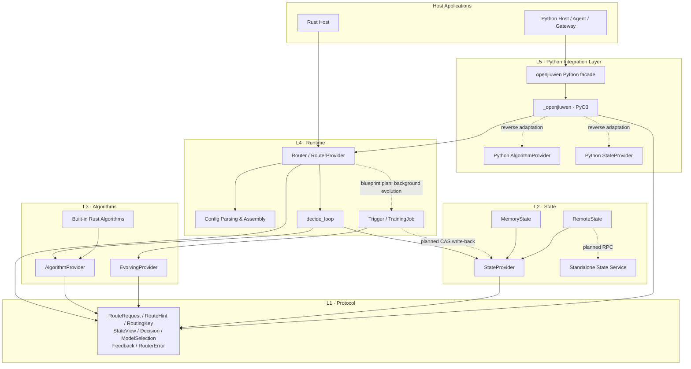
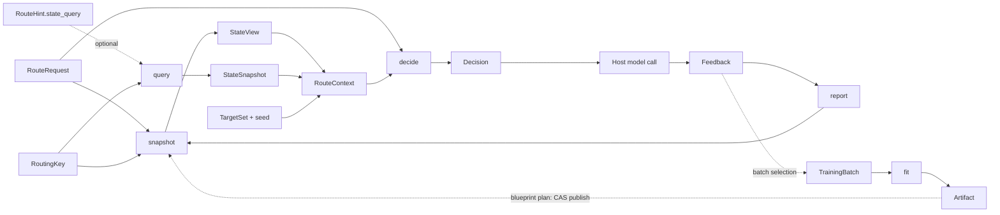

# openjiuwen-router Architecture and Plugin Integration Guide

> This document uses `openjiuwen-router-blueprint.html` as the design baseline and the current repository code as the implementation ground truth.
> Target capabilities from the blueprint and currently unfinished skeletons are clearly distinguished, so planned interfaces are not mistaken for usable ones.

## 1. Project Positioning

openjiuwen-router is a routing kernel whose only job is to "select a model". It does not proxy model requests, does not execute model calls, and does not hold business sessions. The host calls `route` before each model call to obtain the target model, and calls `report` after the model call finishes to feed back the result.

A complete call follows this closed loop:

```text
Host constructs a RouteRequest
    → Router obtains a StateView from the StateProvider
    → Router assembles a RouteContext
    → AlgorithmProvider computes a Decision
    → Host invokes the selected model
    → Host constructs a Feedback
    → Router writes the Feedback back to the StateProvider
```

The core architectural goals are:

- Algorithms stay pure functions; edge-side Rust, cloud-side Rust, and cloud-side Python algorithms share the same decision model.
- All cross-request state is externalized into state; algorithms only read a one-shot state snapshot.
- Model calls belong to the host; the router only outputs a selection result and never enters the model traffic path.
- Plugins integrate through stable, narrow function contracts instead of inheriting a complex lifecycle framework.
- Edge/cloud differences are absorbed by assembly configuration and adapters as much as possible, never entering algorithm logic.

## 2. Logical Dependency View

### 2.1 Layers and Dependency Direction



Dependencies must remain unidirectional:

| Layer | Crate / Package | Responsibility | Allowed Dependencies |
|---|---|---|---|
| L1 | `openjiuwen-protocol` | Cross-module data types and error types | No in-project dependencies |
| L2 | `openjiuwen-state` | State plugin contract, memory/remote implementations | protocol |
| L3 | `openjiuwen-algorithms` | Routing algorithms and self-evolving pure-computation contracts | protocol |
| L4 | `openjiuwen-runtime` | Config assembly, decision loop, feedback forwarding, training skeleton | protocol, state, algorithms |
| L5 | `openjiuwen` / `_openjiuwen` | Python facade, type conversion, reverse binding of Python plugins | runtime, protocol, state, algorithms |
| Host | User project | Model calls, retries, lifecycle hooks, business context | Rust runtime or Python facade |

Key constraint: there is no direct dependency between `state` and `algorithm`. State output can only reach the Algorithm after the runtime places it into `RouteContext.view`.

Solid lines in the diagram represent the current main call chain; dashed lines marked "blueprint plan" represent paths whose types or skeletons exist but whose runtime wiring is not yet complete.

### 2.2 Control Flow Ownership

The Runtime is the sole owner of control flow:

1. Generate a `RoutingKey` from request metadata.
2. Generate this decision's `decision_id`; read the current state slot: call `snapshot` when `RouteHint.state_query` is empty, otherwise inject the `decision_id` into the `StateQuery` and call the optional `query`; fall back to `snapshot` if `query` fails or returns out-of-bounds data.
3. Merge request exclusions and state exclusions.
4. Assemble a `RouteContext` scoped to this request only.
5. Call `decide` on the current algorithm slot.
6. Return the `Decision` to the host, projected as `ModelSelection` when crossing languages.
7. The host invokes the model itself.
8. The host calls `report`, and the runtime forwards the feedback to state.

Algorithm and Evolving do not schedule, do not call models, and do not access the network; State owns all cross-request memory but cannot call back into the Algorithm.

## 3. Data View

### 3.1 Data Sequence of One Route

```mermaid
sequenceDiagram
    autonumber
    participant H as Host
    participant R as Runtime Router
    participant S as StateProvider
    participant A as AlgorithmProvider
    participant M as Model Backend

    H->>R: route(RouteRequest, RouteHint)
    R->>R: RequestMetadata → RoutingKey
    alt hint.state_query is non-empty
        R->>S: query(RoutingKey, StateQuery{…, decision_id})
        S-->>R: StateSnapshot(view, retrieved)
    else no retrieval intent, or query failed
        R->>S: snapshot(RoutingKey)
        S-->>R: StateView
    end
    R->>R: merge exclusions, assemble RouteContext
    R->>A: decide(RouteRequest, RouteContext)
    A-->>R: Decision
    R-->>H: Decision / ModelSelection
    H->>M: invoke(selected_model_id, messages, tools...)
    M-->>H: response / error
    H->>R: report(Feedback)
    R->>S: report(Feedback)
    Note over S,A: No direct call between State and Algorithm; the only coupling data is RouteContext.view / .retrieved
```

This sequence contains two closed loops:

- Decision loop: `RouteRequest → StateView → RouteContext → Decision/ModelSelection`.
- Feedback loop: `Feedback → StateProvider.report → next StateView`.

### 3.2 Core Data Types

| Data Type | Direction | Main Fields | Constraints |
|---|---|---|---|
| `Message` | Host → Runtime/Algorithm | `role`, `content` | Router only transports it; does not interpret business roles |
| `RequestMetadata` | Host → Runtime | `session_id?`, `agent_id?` | The two generate the `RoutingKey` |
| `RoutingKey` | Runtime → State | `session_id`, `agent_id` | `route` and `report` must use the same key |
| `RouteRequest` | Host → Runtime → Algorithm | `messages`, `metadata`, `exclusions` | `exclusions` is maintained by host retry logic |
| `RouteHint` | Host → Runtime | `cache_affinity?`, `state_query?` | Per-request host hints: KV cache affinity and state retrieval intent |
| `StateView` | State → Runtime → Algorithm | `affinity?`, `exclusions`, `stats` | An empty view is a legal result; algorithms must degrade gracefully |
| `StateQuery` | Host → Runtime → State | `text?`, `vector?`, `top_k?`, `extensions`, `decision_id?` | Retrieval input; all fields optional, `None` means that dimension is unconstrained. `decision_id` is injected by the runtime; a host-supplied value is overwritten |
| `RetrievedItem` | State → Runtime → Algorithm | `id`, `score`, `data?` | A single retrieval hit; `score` must be finite |
| `StateSnapshot` | State → Runtime | `view`, `retrieved` | Return type of `query`; empty `retrieved` is equivalent to the old behavior |
| `FeedbackStats` | State → Algorithm | `sample_count` | A hint, not a strongly consistent statistic |
| `RouteContext` | Runtime → Algorithm | `targets`, `view`, `retrieved`, `seed` | Assembled by runtime; plugins do not construct state snapshots themselves |
| `Decision` | Algorithm → Runtime | `selected_model_id`, `reasoning`, `is_answer_call` | Rust-internal decision type |
| `ModelSelection` | Runtime/PyO3 → Host | Same as `Decision` | Cross-boundary projection, consumed by the host or the next-level plugin |
| `Feedback` | Host → Runtime → State | `version`, `event_id?`, `decision_id?`, `key`, `selected_model_id`, `observed_at_ms?`, `call?`, `extensions` | Concrete non-generic struct; `Overflow/Unavailable` can drive exclusion |
| `CallFeedback` | Nested in `Feedback.call` | `outcome`, `latency_ms?`, `cache_valid?` | `call = None` means delayed / unknown evaluation |
| `Extension` | Nested in `Feedback.extensions` | `schema`, `version`, `data` | `schema` / `version` non-empty; `data` is a constrained `Value` |
| `TrainingBatch` | Runtime → Evolving | `feedbacks`, `prompts` | Training input assembled by DataSelector; `prompts` is the rich-sample channel |
| `TrainingPrompt` | Host journal → Runtime → Evolving | `prompt_id?`, `key`, `request?`, `decision?`, `feedback?`, `text?`, `extensions` | The request → decision → feedback triple; a missing field means unknown |
| `Artifact` | Evolving → Runtime | `kind`, `payload` | Immutable training artifact; planned to be published to state via CAS |

#### 3.2.1 Why `Feedback` is structured as a stable core plus versioned extensions

`Feedback` is what the host reports back after each model call. It must carry signals common to both applications and algorithms, yet it must not keep changing every time one host or algorithm has a private need. Hence a **concrete non-generic struct** rather than `Feedback<T>`:

- **No generics.** A type parameter would leak into `StateProvider`, `TrainingBatch`, the PyO3 boundary, and the Python side; every new payload would force the whole chain to be re-instantiated, and Python cannot express generics anyway. Protocol types are the shared vocabulary between modules and must stay a single concrete type.
- **Stable core**: `version`, `event_id`, `decision_id`, `key`, `selected_model_id`, `observed_at_ms`, `call`. The runtime defines these, and every implementer shares the same semantics.
- **Versioned extensions**: `extensions: Vec<Extension>`. Host- or algorithm-specific fields go into `Extension { schema, version, data }`, so the public core does not change as business needs grow.
- **Unknown schemas pass through.** This minimal version keeps no schema registry: an unknown `schema` is only structurally validated and then passed through, with an explicit **no-semantics guarantee** — so extensions can evolve without a protocol release.

The extension payload `Value` is a zero-dependency, custom JSON subset (`Null` / `Bool` / `Integer` / `Float` / `String` / `Array` / `Object`), because the protocol layer must not pull in `serde_json` or similar. Validation rules:

| Constraint | Value | Notes |
|---|---|---|
| Byte budget | 65,536 | **Charged by actual type**: strings / keys / `schema` / `version` cost their UTF-8 byte length; every other node costs 8 bytes; cumulative across all extensions |
| Nesting depth | 8 | Including the root node |
| Total element count | 256 | Including the root; cumulative across all extensions |
| Extension count | 32 | Rejected when exceeded |
| Numbers | — | Rejects non-finite numbers (`NaN` / `Inf`) and integers outside `i64` |
| Keys | — | Rejects duplicate keys within one object |

`Feedback::validate` is the single validation entry point: both `Router::try_report` and Python's `PyRouter.report` call it first, and a feedback that fails validation is **never written to state**. `call = None` is a legal state meaning the call outcome is not yet known (delayed evaluation), in which case `latency_ms` / `cache_valid` are absent too.

#### 3.2.2 Where `decision_id` is generated

`decision_id` is generated by the **runtime in `Router::route`, before it enters `decide_loop::run`** (`process id + nanosecond timestamp + in-process atomic sequence`). The algorithm neither generates nor receives it. Inside `run` the id goes to exactly one place: it is injected into `StateQuery.decision_id` for the state's `query` (a host-supplied value is overwritten; when there is no retrieval intent `query` is not called and the id is generated all the same). After `run` returns, the runtime writes the same value into `Decision.decision_id`. `RouteContext` does not carry it.

The purpose is to preserve the algorithm module's **purity**: identical input always yields identical output, which makes replay and table-driven testing possible. If id generation were pushed down into the algorithm, the algorithm would gain a hidden input (its invocation count) and lose that purity. The state is the opposite case — it is the stateful side by definition, and the only party that sees the retrieval text before `decide`; given the id it can open a pending record for this decision and close it when a `report` arrives with the same id (this is exactly how a content-addressed kNN memory uses it). The runtime **only guarantees** in-process uniqueness — not distributed uniqueness, and no deduplication. It is purely an observational handle linking `StateQuery`, `Decision` and `Feedback`.

To return the id on `report`, the host only needs to keep the `ModelSelection` from `route` and put its `decision_id` into the `Feedback` (`Feedback::ok(decision, ...)` extracts it automatically). When absent, it is treated as unknown and is not an error.

### 3.3 Data Ownership

- The host owns business requests, model clients, and model responses.
- The Runtime owns flow orchestration and the current plugin instances.
- The StateProvider owns cross-request state.
- The AlgorithmProvider owns only immutable configuration, not cross-request mutable state.
- The EvolvingProvider only performs one `TrainingBatch → Artifact` transformation.
- Protocol types are the shared vocabulary between modules and contain no I/O or runtime behavior.

## 4. Functional Design of the Three Core Plugins

"Functional" here does not require all plugins to be side-effect free; it means compressing each extension point into a small number of explicit input/output functions, and keeping I/O, lifecycle, and scheduling uniformly in the runtime.

```text
StateView = snapshot(RoutingKey)
StateSnapshot = query(RoutingKey, StateQuery)   # optional; defaults to degrading into snapshot

Decision = decide(RouteRequest, RouteContext {
    targets,
    view: StateView,
    retrieved: [RetrievedItem],
    seed,
})

StateEffect = report(Feedback)

Artifact = fit(TrainingBatch)

PublishEffect = publish(slot, Artifact, expected_version)
```

### 4.1 Algorithm: Request-Level Pure Function

The Algorithm answers "which model should this request select".

```rust
pub trait AlgorithmProvider: Send + Sync {
    fn name(&self) -> &str;

    fn decide(
        &self,
        request: &RouteRequest,
        ctx: &RouteContext,
    ) -> Result<Decision, RouterError>;
}
```

Design discipline:

- `decide` performs no I/O, calls no models, and does not access state.
- It does not read the system clock or global randomness; when randomness is needed, only `ctx.seed` is used.
- Identical inputs must produce identical outputs, enabling replay and table-driven tests.
- When `ctx.view` is empty, it must still return a legal decision or an explicit `NoTarget`.
- `name` must be stable and low-cardinality, used for configuration, registration, and telemetry.

### 4.2 State: Explicit Read/Write Effect Boundary

State answers "which cross-request hints may this decision reference", and absorbs feedback after model calls.

```rust
pub trait StateProvider: Send + Sync {
    fn snapshot(&self, key: &RoutingKey) -> StateView;

    /// Optional extension, a peer of `snapshot`. The default implementation
    /// degrades into `snapshot`, so existing implementations compile unchanged.
    fn query(
        &self,
        key: &RoutingKey,
        query: &StateQuery,
    ) -> Result<StateSnapshot, StateQueryError> {
        let _ = query;
        Ok(StateSnapshot::from_view(self.snapshot(key)))
    }

    fn report(&self, feedback: Feedback);

    fn publish(
        &self,
        slot: &str,
        artifact: &[u8],
        ver: u64,
    ) -> Result<(), CasConflict>;
}
```

Design discipline:

- `snapshot` and `query` are **peer** read entry points: the `snapshot` signature is unchanged, while `query` is layered on as an optional capability. Implementations that only provide `snapshot` behave exactly as before.
- `query` is triggered by the host's `RouteHint.state_query`; when no retrieval intent is carried, the runtime goes straight to `snapshot` with no extra cost.
- `query` returns a `StateSnapshot`: `view` is isomorphic to `snapshot`, and `retrieved` carries retrieval hits such as KNN results.
- Retrieval inputs have hard limits: 16 KiB of text, 4,096 vector dimensions, `top_k` ≤ 256, and at most 256 hits; over-limit inputs are validated and degraded on the runtime side and never reach state.
- State is a hint: bounded and lossy; remote timeouts should return an empty view instead of blocking the request. When `query` fails or returns out-of-bounds data, the runtime degrades to `snapshot` and never blocks routing.
- `report` is a best-effort feedback entry and must not apply write backpressure to `route`.
- State only receives feedback that **has already passed protocol validation**: validation happens on the runtime side (`Router::try_report` / Python `PyRouter.report`), and state implementations do not re-validate.
- `publish` serves evolving's versioned artifact publication; the current trait default implementation is a no-op.
- State does not understand algorithms and does not call algorithms.

The current Rust trait's `report` is a synchronous function, and `MemoryState` also writes synchronously; "asynchronous, return immediately" is the blueprint's target semantics — remote queued write-back is not yet implemented.

### 4.3 Evolving: Batch-Level Pure Function

Evolving answers "given a batch of historical samples, what new parameters should be generated".

```rust
pub trait EvolvingProvider: Send + Sync {
    fn name(&self) -> &str;

    fn fit(&self, batch: &TrainingBatch) -> Arc<Artifact>;
}
```

`TrainingBatch` has two parallel channels:

| Field | Content | Source |
|---|---|---|
| `feedbacks` | `Vec<Feedback>`: only "which model was chosen and how it turned out" | `StateProvider` (a hint layer; it keeps neither the original request nor the decision) |
| `prompts` | `Vec<TrainingPrompt>`: the request → decision → feedback triple, optionally with a host-rendered `text` | Host journal |

All three triple fields in `TrainingPrompt` are optional, consistent with the feedback side's "missing means unknown" convention; `key` is always present and groups samples into the same session / agent. Algorithms that need feedback, decision, and request information use the `prompts` channel; algorithms that can model from aggregate feedback alone keep reading `feedbacks`. The two channels may coexist.

Design discipline:

- `fit` is pure computation: it does not pull data, write state, or manage threads or clocks.
- The Runtime's `DataSelector` prepares the `TrainingBatch`: `feedbacks` come from state, while `prompts` are passed in by the host journal via `DataSelector::with_prompts` (runtime does not persist the decision or request during `route`, so the host is the only source of the original prompt).
- The Runtime's `TriggerRegistry` decides when to trigger.
- The Runtime's `TrainingJob` calls `fit`, then performs a CAS write-back via `StateProvider.publish`.
- Evolving does not occupy the request path's single algorithm slot; it can exist independently across multiple training jobs.

Hard bounds: at most 1024 samples, 64 KiB of rendered text, at most 256 messages, 64 KiB per message; `extensions` share the same `Value` budget as `Feedback.extensions`.

The current implementation only completes `EvolvingProvider`, `TrainingBatch`, `TrainingPrompt`, `Artifact`, and the training/trigger skeleton. `[[evolving]]` TOML can be parsed, but it is not yet connected to `Router` assembly, scheduling, or the CAS publication flow.

### 4.4 How the Three Plugins Form a Closed Loop



This design splits request-level decisions, cross-request memory, and offline/online training into three different time scales:

| Time Scale | Plugin | Input | Output or Effect |
|---|---|---|---|
| Per request | Algorithm | request + current snapshot | Decision |
| Cross-request | State | key / feedback | StateView / state update |
| Batch evolution | Evolving | TrainingBatch | Artifact |

## 5. Northbound Core Interfaces

### 5.1 Rust Host Interface

`Router` is the concrete facade:

| Interface | Parameters | Return Value | Purpose |
|---|---|---|---|
| `Router::from_config(path)` | Config file path | `Result<Router, RouterError>` | Standard production assembly entry |
| `Router::from_toml(text)` | TOML text | `Result<Router, RouterError>` | Tests or text pushed from a config center |
| `Router::from_profile(profile)` | `RouterProfile` | `Result<Router, RouterError>` | Advanced assembly entry |
| `Router::from_parts(algorithm, state, targets)` | Algorithm trait object, state trait object, target set | `Router` | Inject custom Rust plugins |
| `Router::route(req, hint)` | `&RouteRequest`, `&RouteHint` | `Result<Decision, RouterError>` | Execute one decision; fills `decision_id` before returning |
| `Router::try_report(feedback)` | `Feedback` | `Result<(), FeedbackError>` | Validate then forward to state; illegal feedback is not written and the reason is returned |
| `Router::report(feedback)` | `Feedback` | `()` | Compatibility entry: delegates to `try_report`, silently drops illegal feedback |
| `Router::algorithm_name()` | None | `&str` | Logging and telemetry |
| `Router::with_kv_coordinator(cb)` / `set_kv_coordinator(cb)` | `Box<dyn KvCacheCoordinator>` | `Router` / `()` | Currently only stores the callback; never triggered |

When the host needs an object-safe plugin boundary, it can hold a `dyn RouterProvider`:

```rust
pub trait RouterProvider: Send + Sync {
    fn route(
        &self,
        request: &RouteRequest,
        hint: &RouteHint,
    ) -> Result<ModelSelection, RouterError>;

    fn try_report(&self, feedback: Feedback) -> Result<(), FeedbackError>;

    fn report(&self, feedback: Feedback);

    fn algorithm_name(&self) -> &str;
}
```

Note: currently `Router::route` returns `Decision`, while `RouterProvider::route` returns `ModelSelection`. Their fields are identical, but their semantic levels differ.

`try_report` and `report` are **two entries with the same validation semantics**: `try_report` returns a `FeedbackError` on failure and does not write to state; `report` has no return value and is the compatibility entry for hosts that do not care about the reason — it delegates to `try_report` and silently drops on failure. Both execute synchronously and do not wait for write-back to finish. This is consistent across languages: Python's `PyRouter.report` goes straight through `try_report` and converts `FeedbackError` into a Python exception.

### 5.2 Python Host Interface

| Interface | Parameters | Return Value | Current Status |
|---|---|---|---|
| `Router.from_config(config, state=None)` | Path or dict; can inject a Python state | `Router` | Available |
| `Router.from_toml(text)` | TOML text | `Router` | Available |
| `router.route_sync(request, hint=None)` | Typed object or dict | `ModelSelection` | Available; the return value carries `decision_id` |
| `await router.route(request, hint=None)` | Same as above | `ModelSelection` | API available, but internally still executes synchronously |
| `router.report_sync(feedback)` | `Feedback` or dict | `None` | Available; illegal feedback raises a Python exception |
| `await router.report(feedback)` | Same as above | `None` | API available, but internally still executes synchronously |
| `router.algorithm_name()` | None | `str` | Available |
| `router.with_kv_coordinator(cb)` | `(from_model, to_model) -> None` | `Router` | Currently only stores the callback; never triggered |

A Python `request` can be a `RouteRequest`, or a dict like the following:

```python
request = {
    "messages": [{"role": "user", "content": "hello"}],
    "session_id": "session-1",
    "agent_id": "my-agent",
    "exclusions": [],
}
```

### 5.3 Configuration Reference

`Router::from_config` / `from_toml` and Python `Router.from_config` share the same schema; Python dict configs are converted key by key.

| Field | Type | Default | Description |
|---|---|---|---|
| `algorithm` | string | required | Registered algorithm name; unregistered names or uncompiled features fail at assembly time with `RouterError::Config` |
| `[state] backend` | string | required | `memory` / `remote` / a custom name registered via Python `register_state` |
| `[state] ttl_secs` | int | 300 | memory only: entry TTL in seconds |
| `[state] max_entries` | int | 1024 | memory only: capacity bound; when full and a new key is reported, the oldest entry is evicted |
| `[state] endpoint` | string | required for remote | remote only: state service address; a missing value fails assembly with a `Config` error |
| `[state] timeout_ms` | int | 5 | remote only: hard timeout in milliseconds; timeouts degrade to an empty view |
| `[targets] models` | string list | `[]` | Candidate model catalog; when empty, every `route` returns `NoTarget` |
| `[[evolving]] name` | string | required if the table is present | Training job name; currently parsed only, not effective |
| `[[evolving]] kind` | string | none | Artifact kind marker; currently parsed only, not effective |
| `[[evolving]] slot` | string | none | CAS publication target slot; currently parsed only, not effective |

Note: the `evolving` key in a Python dict config is currently ignored by the conversion layer (forced to an empty list); see `crates/py/src/convert.rs`.

Full examples: `config/edge.toml` (memory) and `config/cloud.toml` (remote + `[[evolving]]`).

### 5.4 Error Model

`RouterError` has only four variants, split by phase:

| Variant | Raised During | Typical Cause | Host Handling |
|---|---|---|---|
| `Config(msg)` | Assembly (`from_config` / `from_toml` / `from_profile`) | Unreadable or unparseable config, unregistered algorithm name, unknown state backend, missing remote endpoint | Fail startup; never enter traffic |
| `NoTarget` | Decision (`route`) | No available target after exclusions | Host decides whether to error or degrade |
| `Algorithm(msg)` | Decision | Algorithm implementation returns an error | Handle per business policy |
| `State(msg)` | Decision / report | State implementation returns an error | Must not block requests; state is a hint |

The `report` path has a separate error type, `FeedbackError` (`EmptySchema` / `EmptyVersion` / `NestedTooDeep` / `PayloadTooLarge` / `NonFiniteNumber` / `IntegerOverflow` / `DuplicateKey` / `UnsupportedVersion`). It is deliberately **not** part of `RouterError`: a validation failure is a caller (host) input problem, not a routing-kernel fault, so it is returned separately by `try_report` and maps to `ValueError` on the Python side.

Semantics of `Feedback.call.outcome` (actual `MemoryState` behavior):

| Outcome | Effect on State |
|---|---|
| `Ok` | Updates affinity (`affinity = selected_model_id`); sample count +1 |
| `Overflow` / `Unavailable` | Adds `selected_model_id` to the exclusion list for that `RoutingKey`; sample count +1 |
| `Rejected` | No affinity / exclusion update, but the sample count is still +1 |
| `call = None` (delayed feedback) | Returns immediately; no state update at all (including the sample count) |

`MemoryState` increments `sample_count` before entering the `match`, so any present `call` counts as +1 regardless of the specific `Outcome`.

Business-level semantic failures (e.g. wrong answer content) are not part of `Outcome`; the protocol layer only carries call-level results.

## 6. Integrating the Entire Router as a Plugin into a Host Project

Regardless of whether the host framework calls it rail, hook, middleware, or model client wrapper, the adapter only needs to connect two lifecycle points:

| Host Lifecycle | Router Action | Host Responsibility |
|---|---|---|
| `before_model_call` | Construct the request and call `route` | Switch the model client based on the selection result |
| `after_model_call` | Construct and call `report` | Keep the same `RoutingKey` as route; map the call outcome |

The Router should not take over model clients. The host adapter should retain `selected_model_id`, the start time, and the `RoutingKey`, so it can generate accurate feedback after the call ends.

The rail integration in the blueprint follows the same pattern: `before_model_call` writes the `ModelSelection` into the host's model override slot, and `after_model_call` reports the `Feedback`. The current repository does not yet include agent-core's `RouterRail` / `@harness_element` implementation, so when integrating with a concrete host, this thin adapter layer must be provided in the host repository.

### 6.1 Rust Project Integration

The current workspace crates set `publish = false`; external projects should use path or Git dependencies first:

```toml
[dependencies]
openjiuwen-runtime = { path = "/path/to/private-model-router/crates/runtime" }
```

Minimal call:

```rust
use openjiuwen_runtime::{Feedback, RequestMetadata, RouteHint, RouteRequest, Router};

fn call_once() -> Result<(), Box<dyn std::error::Error>> {
    let router = Router::from_config("config/edge.toml")?;
    let request = RouteRequest {
        metadata: RequestMetadata {
            session_id: Some("session-1".into()),
            agent_id: Some("my-host".into()),
        },
        ..Default::default()
    };

    let decision = router.route(&request, &RouteHint::default())?;
    let decision_id = decision.decision_id.clone();

    // The host invokes the model corresponding to decision.selected_model_id.
    let latency_ms = 25;

    // `Feedback::ok` builds a success feedback; correlation id and observation time can be filled in afterwards.
    let mut feedback = Feedback::ok(request.routing_key(), decision.selected_model_id, latency_ms);
    feedback.decision_id = decision_id;
    feedback.observed_at_ms = Some(1_700_000_000_000); // the host's own clock

    // Use try_report when you need the validation failure reason; use report for silent-drop semantics.
    router.try_report(feedback)?;
    Ok(())
}
```

> Migration note: the old `Feedback` literal (writing `outcome` / `latency_ms` / `cache_valid` at the top level) has been replaced by `call: Option<CallFeedback>`. Old literals no longer compile; use the `Feedback::ok` / `Feedback::delayed` constructors, or set `call: Some(CallFeedback { .. })` explicitly.

If the host has a unified plugin container, it can hold a `Box<dyn RouterProvider>` or `Arc<dyn RouterProvider>`, using `route/report/algorithm_name` as the plugin protocol.

### 6.2 Python Project Integration

Build and install the extension at the repository root:

```bash
maturin develop
```

Minimal synchronous integration:

```python
from openjiuwen import Feedback, Outcome, Router

router = Router.from_config("config/cloud.toml")

request = {
    "messages": [{"role": "user", "content": "hello"}],
    "session_id": "session-1",
    "agent_id": "my-host",
}

selection = router.route_sync(request)

# response = model_clients[selection.selected_model_id].invoke(...)

# `Feedback.ok` extracts decision_id from the selection automatically, correlating route with report.
router.report_sync(
    Feedback.ok(
        selection,
        latency_ms=25,
        session_id="session-1",
        agent_id="my-host",
        outcome=Outcome.OK,
    )
)
```

When you need to carry application-private signals, attach them as `Extension` without touching the public core:

```python
from openjiuwen import CallFeedback, Extension, Feedback, RoutingKey

feedback = Feedback(
    key=RoutingKey(session_id="session-1", agent_id="my-host"),
    selected_model_id=selection.selected_model_id,
    decision_id=selection.decision_id,
    call=CallFeedback(outcome=Outcome.OK, latency_ms=25),
    extensions=[
        Extension(schema="myapp.usage.v1", version="1.0", data={"tokens": 128, "tier": "gold"}),
    ],
)
router.report_sync(feedback)               # raises ValueError if validation fails
```

A plain dict works too (field names as above; `call` / `extensions` may themselves be dicts):

```python
router.report_sync({
    "key": {"session_id": "session-1", "agent_id": "my-host"},
    "selected_model_id": selection.selected_model_id,
    "decision_id": selection.decision_id,
    "call": {"outcome": "ok", "latency_ms": 25},
})
```

The `dict` and typed-object paths are semantically identical: `call` and the legacy top-level fields (`outcome` / `latency_ms` / `cache_valid`) are mutually exclusive, and supplying both raises an error; an explicit `call=None` means delayed feedback, in which case the legacy fields are not written.

The blueprint target interface is `await router.route/report`. The current async methods still execute the synchronous kernel directly; before integrating with a high-concurrency asyncio host, a real async bridge must be completed, or the host must place the synchronous calls into a controlled blocking executor.

A framework-agnostic host plugin shell can keep the following shape:

```python
import time

from openjiuwen import Feedback, Outcome, Router


class RouterPlugin:
    def __init__(self, config):
        self.router = Router.from_config(config)

    def before_model_call(self, ctx):
        request = {
            "messages": ctx.messages,
            "session_id": ctx.session_id,
            "agent_id": ctx.agent_id,
            "exclusions": ctx.exclusions,
        }
        selection = self.router.route_sync(request)
        ctx.model_name = selection.selected_model_id
        ctx.router_selection = selection
        ctx.router_started_at = time.monotonic()

    def after_model_call(self, ctx, error=None):
        outcome = Outcome.OK if error is None else Outcome.UNAVAILABLE
        latency_ms = int((time.monotonic() - ctx.router_started_at) * 1000)
        self.router.report_sync(
            Feedback.ok(
                ctx.router_selection,
                latency_ms=latency_ms,
                session_id=ctx.session_id,
                agent_id=ctx.agent_id,
                outcome=outcome,
            )
        )
```

A real framework needs to subdivide exceptions into `OVERFLOW`, `UNAVAILABLE`, and `REJECTED`, and ensure that failed models are added to the next request's `exclusions` during retry.

## 7. Implementing and Replacing an Algorithm

### 7.1 Built-in Algorithm Catalog

Built-in Rust algorithms are registered by name in the runtime registry, all gated behind features, and all enabled by default:

| Name | Feature | Current Behavior |
|---|---|---|
| `passthrough` | `algo-passthrough` | Selects the first target in the filtered catalog; usable |
| `weighted` | `algo-weighted` | Stub: falls back to the first target |
| `rule_cascade` | `algo-rule_cascade` | Stub: falls back to the first target |
| `signal` | `algo-signal` | Stub: falls back to the first target |
| `ensemble` | `algo-ensemble` | Stub: falls back to the first target |

Adding a new built-in algorithm requires three coordinated changes: implement it in `crates/algorithms` behind a feature, register the name in `crates/runtime/src/registry.rs`, and declare the feature in both `crates/algorithms/Cargo.toml` and `crates/runtime/Cargo.toml`.

Bundled Python algorithms are auto-installed by `discover` scanning sibling subpackages on `import openjiuwen`, and can be assembled by name directly:

| Name | Location | Description |
|---|---|---|
|  `x-router` | `x_router/` | Classifies a request into five complexity tiers with a small model and picks a target per tier; see [`x-router/README.md`](../../python/openjiuwen/x_router/README.md) |
| `python_cost_aware` | `test_algo/cost_aware.py` | Example: picks the lowest-cost target from a class-attribute cost table |
| `python_last_available` | `test_algo2/last_available.py` | Example: picks the last target in the filtered catalog |

The latter two are references for writing custom Python algorithms and demonstrate the minimal `AlgorithmProvider` shape.  `x-router` is a full implementation; classifying with a model needs the `openjiuwen[x-router]` extra, and without it x-router falls back to its built-in heuristic classifier.

### 7.2 Rust Algorithm

Implement `AlgorithmProvider`:

A custom Rust plugin needs to directly depend on the plugin contract and protocol crates:

```toml
[dependencies]
openjiuwen-runtime = { path = "/path/to/private-model-router/crates/runtime" }
openjiuwen-protocol = { path = "/path/to/private-model-router/crates/protocol" }
openjiuwen-algorithms = { path = "/path/to/private-model-router/crates/algorithms" }
openjiuwen-state = { path = "/path/to/private-model-router/crates/state" }
```

```rust
use openjiuwen_algorithms::{AlgorithmProvider, RouteContext};
use openjiuwen_protocol::{Decision, RouteRequest, RouterError};

struct FirstAvailable;

impl AlgorithmProvider for FirstAvailable {
    fn name(&self) -> &str {
        "first_available"
    }

    fn decide(
        &self,
        _request: &RouteRequest,
        ctx: &RouteContext,
    ) -> Result<Decision, RouterError> {
        let target = ctx.targets.first().ok_or(RouterError::NoTarget)?;
        Ok(Decision::answer(target, "first available target"))
    }
}
```

There are two replacement approaches:

1. Built-in algorithm: add the implementation to the algorithms crate, register its name and feature in the runtime registry, then change the profile's `algorithm = "..."` and rebuild/restart.
2. External algorithm: the host constructs the implementation and injects it via `Router::from_parts`, without depending on the built-in registry.

The latest code has removed `replace_algorithm`. In-place hot replacement on the same Router instance is currently unsupported; runtime replacement should create a new Router, and the host then atomically switches the instance or performs a rolling restart.

### 7.3 Python Algorithm

Python subclasses are automatically registered by `name` at definition time; they must be constructible with no arguments, with configuration placed on class attributes:

```python
from openjiuwen import AlgorithmProvider, Router


class Cheapest(AlgorithmProvider):
    name = "cheapest"
    costs = {"fast": 10.0, "cheap": 1.0}

    def decide(self, request, ctx):
        del request
        if not ctx.targets:
            raise ValueError("no available target")
        target = min(ctx.targets, key=lambda item: self.costs.get(item, float("inf")))
        return {
            "selected_model_id": target,
            "reasoning": "lowest configured cost",
            "is_answer_call": True,
        }


# The class must be imported/defined first, then assembled by name.
router = Router.from_config({
    "algorithm": "cheapest",
    "state": {"backend": "memory"},
    "targets": {"models": ["fast", "cheap"]},
})
```

The current registry is a process-global `name → Python object`. A same-named implementation overwrites the old value, so plugin names must use stable, non-conflicting naming; after replacement, create a new Router — existing Routers still hold the original adapted object.

Key details of the registration mechanism:

- Subclasses are validated at definition time: they must implement `decide`, set a non-empty `name`, and be constructible with no arguments; violating any rule raises `TypeError` at class definition.
- When the extension is not built, subclasses enter a `_pending` queue and are registered later by `bind_register` once the extension becomes available, so plugin module import order does not depend on build state.
- On `import openjiuwen`, `discover.install()` scans sibling subpackages of `openjiuwen` (skipping `_`-prefixed ones) and writes every `AlgorithmProvider` subclass with a stable `name` into the Rust slot; names are deduplicated, first one wins.
- `openjiuwen.check_purity(algo, request, ctx)` calls `decide` repeatedly with identical inputs and compares the outputs, for verifying pure-function discipline.
- `Algorithm` is a legacy alias of `AlgorithmProvider`, kept for compatibility; do not use it in new code.

## 8. Implementing and Replacing State

### 8.1 Rust State

```rust
use openjiuwen_protocol::{Feedback, RoutingKey, StateView};
use openjiuwen_state::StateProvider;

struct EmptyState;

impl StateProvider for EmptyState {
    fn snapshot(&self, _key: &RoutingKey) -> StateView {
        StateView::empty()
    }

    fn report(&self, _feedback: Feedback) {}
}
```

Built-in state can be replaced via profile:

```toml
[state]
backend = "memory"
ttl_secs = 300
max_entries = 1024
```

or:

```toml
[state]
backend = "remote"
endpoint = "http://127.0.0.1:50051"
timeout_ms = 5
```

Note: the current `RemoteState` is still a skeleton — it does not issue real RPCs; `snapshot` returns an empty view and `report` performs no write.

A custom Rust state is injected via `Router::from_parts` together with a custom or built-in algorithm:

```rust
use std::sync::Arc;
use openjiuwen_protocol::TargetSet;
use openjiuwen_runtime::Router;

let router = Router::from_parts(
    Box::new(FirstAvailable),
    Arc::new(EmptyState),
    TargetSet::new(["fast", "cheap"]),
);
```

### 8.2 Python State

```python
from openjiuwen import Outcome, StateProvider


class ExclusionStore(StateProvider):
    name = "my_exclusion_store"

    def __init__(self):
        self._excluded = {}

    def snapshot(self, key):
        slot = (key.session_id, key.agent_id)
        return {
            "affinity": None,
            "exclusions": list(self._excluded.get(slot, [])),
        }

    def report(self, feedback):
        if feedback.outcome != Outcome.UNAVAILABLE:
            return
        slot = (feedback.key.session_id, feedback.key.agent_id)
        self._excluded.setdefault(slot, []).append(feedback.selected_model_id)
```

Injecting an instance directly is recommended — the lifecycle is clearest:

```python
router = Router.from_config(config, state=ExclusionStore())
```

When finer-grained retrieval (for example text or vector KNN) is needed, additionally implement the optional `query`:

```python
class VectorStore(StateProvider):
    name = "my_vector_store"

    def snapshot(self, key):
        return {}  # degradation path when no retrieval intent is carried

    def query(self, key, query):
        hits = self._index.search(query.vector or self._embed(query.text),
                                  k=query.top_k or 8)
        return {
            "view": {"exclusions": [], "affinity": None},
            "retrieved": [
                {"id": hit.id, "score": hit.score, "data": hit.payload}
                for hit in hits
            ],
        }
```

The host passes retrieval intent through `RouteHint`:

```python
from openjiuwen import RouteHint, StateQuery

hint = RouteHint(state_query=StateQuery(text="caching strategy", top_k=4))
# or pass a vector directly: StateQuery(vector=self._embed(text), top_k=4)
decision = router.route_sync(request, hint)
```

On the algorithm side, hits are read from `ctx.retrieved` (`id` / `score` / `data`). Legacy plugins that do not implement `query` need no changes at all: the runtime automatically degrades to `snapshot` and `ctx.retrieved` is an empty list; a `query` that raises or returns out-of-bounds data degrades the same way without blocking routing.

It can also be registered as a named backend:

```python
from openjiuwen import register_state

register_state(ExclusionStore())

router = Router.from_config({
    "algorithm": "passthrough",
    "state": {"backend": "my_exclusion_store"},
    "targets": {"models": ["fast", "cheap"]},
})
```

`register_state` uses a process-global registry; same names overwrite. `replace_state` has been removed; replacing state should create a new Router, or the host should switch to a new Router instance.

The Python adapter degrades `snapshot` exceptions or illegal returns to an empty view, and ignores `report` exceptions. Production plugins should record their own metrics and errors, otherwise failures will manifest as silent cold routing.

## 9. Implementing and Replacing Evolving

Evolving currently has only a Rust contract — no Python bindings, and it is not connected to the Router assembly path. The Rust TOML parser reads `[[evolving]]`, but the Python dict config conversion currently sets `evolving` to an empty list directly.

```rust
use std::sync::Arc;
use openjiuwen_algorithms::{Artifact, EvolvingProvider, TrainingBatch};

struct MyTrainer;

impl EvolvingProvider for MyTrainer {
    fn name(&self) -> &str {
        "my-trainer"
    }

    fn fit(&self, batch: &TrainingBatch) -> Arc<Artifact> {
        // Prefer rich samples; fall back to plain feedback.
        let samples = if batch.prompts.is_empty() {
            batch.feedbacks.len()
        } else {
            batch.prompts.len()
        };
        let payload = format!("samples={samples}").into_bytes();
        Arc::new(Artifact {
            kind: "MyWeights".into(),
            payload,
        })
    }
}
```

When the original prompt is needed, read `batch.prompts`: each `TrainingPrompt` carries `request` (what was asked), `decision` (why that model was chosen), and `feedback` (how it turned out); the host may also supply a pre-rendered `text`.

The currently usable invocation is for the host or a self-built scheduler to explicitly select an implementation and attach the journal's samples:

```rust
use openjiuwen_runtime::training::{DataSelector, PublishPlan, TrainingJob};

let job = TrainingJob {
    name: "refresh-weights".into(),
    selector: DataSelector {
        watermark_key: "router-feedback".into(),
        min_samples: 100,
        prompts: host_journal.drain_training_prompts(), // Vec<TrainingPrompt>
    },
    publish: PublishPlan {
        slot: "state.my_weights".into(),
        expected_version: 1,
    },
};

let artifact = job.run_once(&MyTrainer);
```

Currently `DataSelector::select` only passes samples through, and `TrainingJob::run_once` only calls `fit` and returns the artifact — it does not yet execute `StateProvider.publish`. Therefore, replacing Evolving in practice means: in the host's training scheduler, swap the implementation passed to `run_once` for another `EvolvingProvider`.

The blueprint goal is declarative selection and CAS publication through `[[evolving]]`, `TriggerRegistry`, and `TrainingJob`. Until that path is complete, modifying `[[evolving]]` configuration must not be described as already being able to replace a running Evolving.

## 10. Summary Table of the Three Plugin Replacement Methods

| Plugin | Config Selection | Rust Direct Injection | Python Injection | Current Hot Replacement |
|---|---|---|---|---|
| Algorithm | `algorithm = "name"`, only for registered implementations | `Router::from_parts(Box<dyn AlgorithmProvider>, ...)` | Define/import an `AlgorithmProvider` subclass, then assemble by name | Not supported; create a new Router |
| State | `[state] backend = "memory|remote|custom name"` | `Router::from_parts(..., Arc<dyn StateProvider>, ...)` | `state=instance`, or `register_state` + backend name | Not supported; create a new Router |
| Evolving | `[[evolving]]` currently parsed only, not effective | Host passes the implementation to `TrainingJob::run_once` | Not currently supported | Not supported; the training scheduler switches implementations |

The recommended production replacement pattern is "construct a new instance, then switch the reference":

1. Load and validate the new configuration and plugins.
2. Construct a new Router or training job.
3. Complete health checks and a minimal decision test.
4. The host switches using an atomic reference, dependency injection container, or rolling release.
5. Let in-flight requests on the old instance finish before reclaiming it.

This avoids half-updated states when modifying multiple related slots inside one Router.

## 11. Current Implementation Boundaries

| Capability | Status | Handling When Integrating |
|---|---|---|
| Rust `Router::from_config/route/try_report/report` | Implemented | Can be used as the current stable main path |
| Rust `AlgorithmProvider` / `StateProvider` | Implemented | Injectable via `from_parts` |
| Python Algorithm reverse binding | Implemented | Import the subclass, then assemble by name |
| Python State reverse binding | Implemented | Prefer `state=instance` |
| MemoryState | Basic TTL/capacity/exclusion/affinity implemented | Usable locally and in tests |
| RemoteState RPC | Skeleton | Currently only degrades to empty state |
| Python real async bridge | Not implemented | Async facade is still synchronous internally |
| `Feedback.extensions` versioned extension | Structural validation and pass-through implemented | Unknown schemas carry no semantics; no registry |
| Feedback dedup / exactly-once | Not implemented | `decision_id` is only a correlation handle, not a delivery guarantee |
| `RouteHint.cache_affinity` | Defined but not consumed | Do not rely on its decision effect for now |
| `RouteHint.state_query` + `StateProvider::query` | Implemented (full Rust + Python chain) | Falls back to `snapshot` when no retrieval intent is carried; failures degrade automatically and never block routing |
| KV coordinator callback | Stored only, never triggered | Do not rely on its switching effect for now |
| Evolving config, trigger, scheduling, CAS publication | Skeleton | Host must schedule it itself; changing TOML alone is not enough |
| `evolving` config in Python dict | Not connected | Current conversion ignores this field |
| Algorithm/State in-place hot replacement | Removed | Create a new Router and let the host switch |

## 12. Developer Integration Checklist

- Provide a stable `session_id` and `agent_id` for every request.
- `report` uses exactly the same `RoutingKey` as `route`.
- Use `try_report` (Rust) / `report_sync` (Python, raises) when you need to know why feedback was rejected; otherwise `report` silently drops illegal values.
- The host is responsible for model calls and failure retries; the Router does not proxy traffic.
- The Algorithm still works with an empty `StateView`.
- Implement `StateProvider::query` when finer retrieval is needed, and pass retrieval intent via `RouteHint.state_query`; plugins that only implement `snapshot` need no changes.
- Retrieval hits returned by `query` are hints: the algorithm must degrade when `retrieved` is empty.
- Algorithm/Evolving perform no I/O and keep no cross-call mutable state.
- State's remote failure path returns an empty view; it must not wait indefinitely.
- Custom plugins use unique, stable `name`s.
- Put private signals in `Feedback.extensions` with their own version; do not change the protocol core for business fields.
- When replacing an Algorithm or State, build a new Router; do not modify an in-flight instance.
- Before enabling remote, async, KV callback, or evolving auto-scheduling, first confirm the corresponding skeleton is complete.
- Cover at least one end-to-end test of `route → model failure → report(Unavailable) → next route switches model`.

## 13. Code Index

| Content | Path |
|---|---|
| Protocol types | `crates/protocol/src/` |
| Feedback / Extension / Value definition and validation | `crates/protocol/src/feedback.rs` |
| StateQuery / RetrievedItem / StateSnapshot | `crates/protocol/src/state_query.rs` |
| Algorithm contract | `crates/algorithms/src/algorithm_provider.rs` |
| Evolving contract | `crates/algorithms/src/evolving_provider.rs` |
| State contract | `crates/state/src/state_provider.rs` |
| MemoryState implementation | `crates/state/src/test_state/memory.rs` |
| RemoteState skeleton | `crates/state/src/test_state/remote.rs` |
| Standalone State Service skeleton | `crates/state/src/service/main.rs` |
| Router facade | `crates/runtime/src/router.rs` |
| Rust northbound trait | `crates/runtime/src/router_provider.rs` |
| Decision loop | `crates/runtime/src/decide_loop.rs` |
| Rust algorithm registry | `crates/runtime/src/registry.rs` |
| Config parsing | `crates/runtime/src/config.rs` |
| Training/trigger skeleton | `crates/runtime/src/training.rs`, `crates/runtime/src/trigger.rs` |
| PyO3 facade | `crates/py/src/lib.rs` |
| Python Algorithm adapter | `crates/py/src/adapter.rs` |
| Python State adapter | `crates/py/src/state_adapter.rs` |
| Python dict config conversion | `crates/py/src/convert.rs` |
| Python typed object definitions (Feedback / Extension / CallFeedback) | `crates/py/src/types.rs` |
| Python user facade | `python/openjiuwen/__init__.py` |
| Python plugin contracts | `python/openjiuwen/algorithm_provider.py`, `python/openjiuwen/state_provider.py` |
| Python bundled-algorithm discovery | `python/openjiuwen/discover.py` |
| Python extension type stubs | `python/openjiuwen/_openjiuwen.pyi` |
| End-to-end example hosts | `tests/react_agent.rs`, `tests/react_agent.py` |
| Host integration examples | `examples/python_integration.py`, `examples/rust_integration/` |
