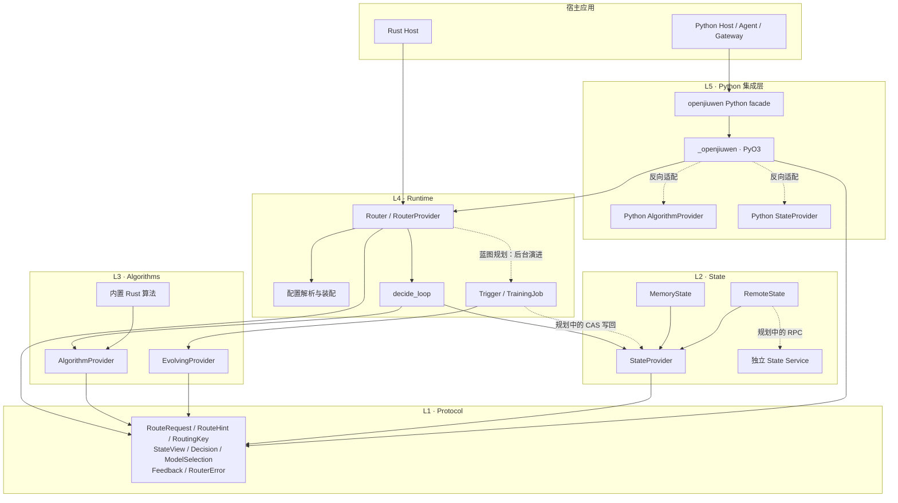
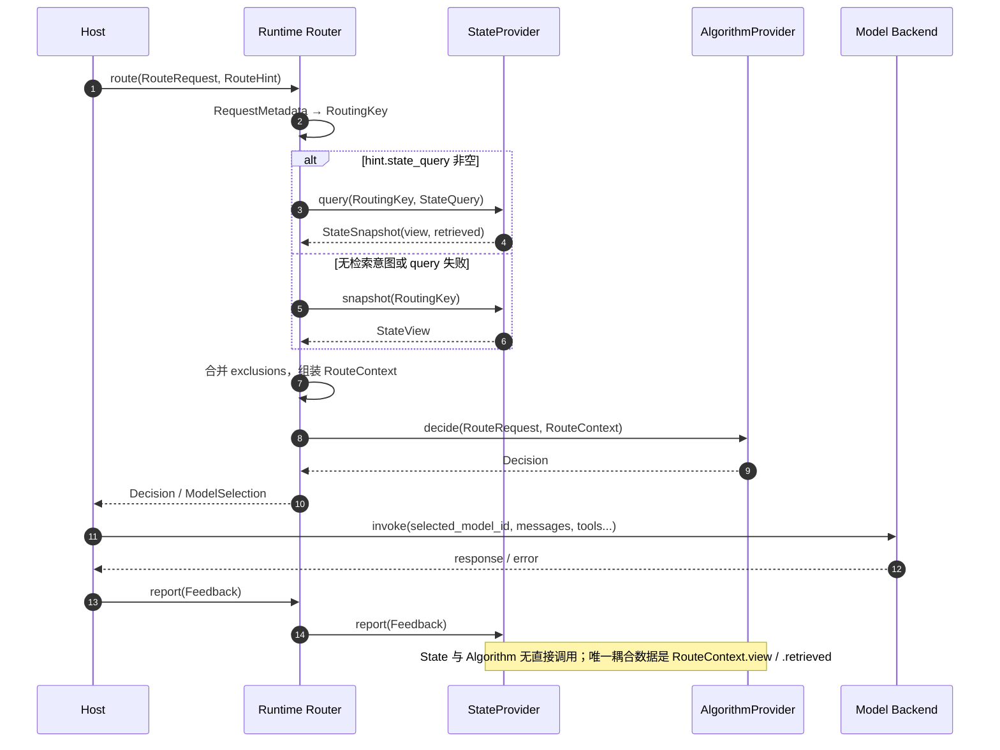
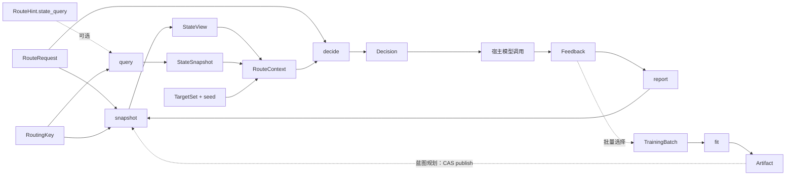

# openjiuwen-router 架构与插件接入指南

> 本文以 `openjiuwen-router-blueprint.html` 为设计基线，以当前仓库代码为实现事实。
> 蓝图中的目标能力与当前尚未完成的骨架会明确区分，避免把规划接口误认为已经可用。

## 1. 项目定位

openjiuwen-router 是一个只负责“选择模型”的路由内核。它不代理模型请求，不执行模型调用，也不持有业务会话；宿主在每次模型调用前调用 `route` 获得目标模型，在模型调用结束后调用 `report` 回报结果。

一次完整调用遵循下面的闭环：

```text
宿主构造 RouteRequest
    → Router 从 StateProvider 获取 StateView
    → Router 组装 RouteContext
    → AlgorithmProvider 计算 Decision
    → 宿主调用被选中的模型
    → 宿主构造 Feedback
    → Router 将 Feedback 写回 StateProvider
```

架构的核心目标是：

- 算法保持纯函数，端侧 Rust、云侧 Rust 和云侧 Python 算法共用同一个决策模型。
- 跨请求状态全部外置到 state，算法只读取一次性状态快照。
- 模型调用归宿主，路由器只输出选择结果，不进入模型流量链路。
- 插件通过稳定、窄小的函数契约接入，而不是继承复杂生命周期框架。
- 端云差异尽量由装配配置和适配器吸收，不进入算法逻辑。

## 2. 逻辑依赖视图

### 2.1 分层与依赖方向



依赖必须保持单向：

| 层 | Crate / 包 | 职责 | 允许依赖 |
|---|---|---|---|
| L1 | `openjiuwen-protocol` | 跨模块数据类型和错误类型 | 无项目内依赖 |
| L2 | `openjiuwen-state` | 状态插件契约、memory/remote 实现 | protocol |
| L3 | `openjiuwen-algorithms` | 路由算法与自演进纯计算契约 | protocol |
| L4 | `openjiuwen-runtime` | 配置装配、决策循环、反馈转发、训练骨架 | protocol、state、algorithms |
| L5 | `openjiuwen` / `_openjiuwen` | Python 门面、类型转换、Python 插件反向绑定 | runtime、protocol、state、algorithms |
| Host | 用户项目 | 模型调用、重试、生命周期钩子、业务上下文 | Rust runtime 或 Python facade |

关键约束：`state` 与 `algorithm` 之间没有直接依赖。State 的输出只能由 runtime 放入 `RouteContext.view` 后传给 Algorithm。

图中的实线表示当前主调用链，标有“蓝图规划”的虚线表示已有类型或骨架、但尚未完成运行时接线的路径。

### 2.2 控制流归属

Runtime 是唯一的控制流拥有者：

1. 从请求元数据生成 `RoutingKey`。
2. 读取当前 state 槽：`RouteHint.state_query` 为空时调用 `snapshot`，否则调用可选的 `query`；`query` 失败或返回越界时降级为 `snapshot`。
3. 合并请求排除项和状态排除项。
4. 组装只针对本次请求的 `RouteContext`。
5. 调用当前 algorithm 槽的 `decide`。
6. 将 `Decision` 返回给宿主，跨语言时投影为 `ModelSelection`。
7. 宿主自行调用模型。
8. 宿主调用 `report`，runtime 将反馈转给 state。

Algorithm 和 Evolving 不负责调度、不调用模型、不访问网络；State 负责所有跨请求记忆，但不能反向调用 Algorithm。

## 3. 数据视图

### 3.1 一次路由的数据时序



该时序包含两个闭环：

- 决策环：`RouteRequest → StateView → RouteContext → Decision/ModelSelection`。
- 反馈环：`Feedback → StateProvider.report → 下一次 StateView`。

### 3.2 核心数据类型

| 数据类型 | 方向 | 主要字段 | 约束 |
|---|---|---|---|
| `Message` | Host → Runtime/Algorithm | `role`, `content` | Router 只搬运，不解释业务角色 |
| `RequestMetadata` | Host → Runtime | `session_id?`, `agent_id?` | 两者生成 `RoutingKey` |
| `RoutingKey` | Runtime → State | `session_id`, `agent_id` | `route` 与 `report` 必须使用同一键 |
| `RouteRequest` | Host → Runtime → Algorithm | `messages`, `metadata`, `exclusions` | `exclusions` 由宿主重试逻辑维护 |
| `RouteHint` | Host → Runtime | `cache_affinity?`, `state_query?` | 宿主的每请求提示：KV cache 亲和与状态检索意图 |
| `StateView` | State → Runtime → Algorithm | `affinity?`, `exclusions`, `stats` | 空视图是合法结果，算法必须可降级 |
| `StateQuery` | Host → Runtime → State | `text?`, `vector?`, `top_k?`, `extensions` | 检索入参；全部可选，`None` 表示不约束该维度 |
| `RetrievedItem` | State → Runtime → Algorithm | `id`, `score`, `data?` | 单条检索命中；`score` 必须有限 |
| `StateSnapshot` | State → Runtime | `view`, `retrieved` | `query` 的返回；`retrieved` 为空即等价旧行为 |
| `FeedbackStats` | State → Algorithm | `sample_count` | 是 hint，不是强一致统计 |
| `RouteContext` | Runtime → Algorithm | `targets`, `view`, `retrieved`, `seed` | runtime 组装；插件不自行构造状态快照 |
| `Decision` | Algorithm → Runtime | `selected_model_id`, `reasoning`, `is_answer_call` | Rust 内部决策类型 |
| `ModelSelection` | Runtime/PyO3 → Host | 与 `Decision` 相同 | 跨边界投影，供宿主或下一级插件消费 |
| `Feedback` | Host → Runtime → State | `version`, `event_id?`, `decision_id?`, `key`, `selected_model_id`, `observed_at_ms?`, `call?`, `extensions` | 具体非泛型结构；`Overflow/Unavailable` 可驱动排除 |
| `CallFeedback` | 内含于 `Feedback.call` | `outcome`, `latency_ms?`, `cache_valid?` | `call = None` 表示延迟 / 未知评价 |
| `Extension` | 内含于 `Feedback.extensions` | `schema`, `version`, `data` | `schema` / `version` 非空；`data` 为受约束 `Value` |
| `TrainingBatch` | Runtime → Evolving | `feedbacks` | 由 DataSelector 按 watermark 组装的训练输入 |
| `Artifact` | Evolving → Runtime | `kind`, `payload` | 不可变训练产物，规划通过 CAS 发布到 state |

#### 3.2.1 Feedback 的结构选择：稳定核心 + 版本化扩展

`Feedback` 是宿主每次模型调用后回报的调用结果。它既需要承载应用与算法都关心的通用信号，又不能因为个别宿主 / 算法的私有需求而不断改动公共类型，因此采用**具体非泛型结构**，而不是 `Feedback<T>`：

- **不做泛型**。泛型会把类型参数传染到 `StateProvider`、`TrainingBatch`、PyO3 边界乃至 Python 侧，任何新载荷都会迫使整条链路重新实例化；跨语言场景下 Python 也无法表达泛型。协议类型必须是模块间的共同词汇表，保持单一具体类型。
- **稳定核心**：`version`、`event_id`、`decision_id`、`key`、`selected_model_id`、`observed_at_ms`、`call`。这些字段由 runtime 定义，所有实现方共享同一语义。
- **版本化扩展**：`extensions: Vec<Extension>`。宿主或算法自己的字段放进 `Extension { schema, version, data }`，公共核心不随业务扩张而修改。
- **未知 schema 也透传**。当前最小版本不维护 schema 注册表：未知 `schema` 仅做结构校验后透传，明确**不承诺语义**；这样扩展的演进不需要协议层发版。

扩展载荷 `Value` 是零依赖的自定义 JSON 子集（`Null` / `Bool` / `Integer` / `Float` / `String` / `Array` / `Object`），因为协议层不允许引入 `serde_json` 等外部依赖。校验规则：

| 约束 | 值 | 说明 |
|---|---|---|
| 字节预算 | 65 536 | **按实际类型计费**：字符串 / 键 / `schema` / `version` 记 UTF-8 字节数，其余节点各记 8 字节；跨全部扩展累计 |
| 嵌套深度 | 8 | 含根节点 |
| 元素总数 | 256 | 含根节点，跨全部扩展累计 |
| 扩展条数 | 32 | 超出即拒绝 |
| 数值 | — | 拒绝非有限数（`NaN` / `Inf`）与超出 `i64` 的整数 |
| 键 | — | 拒绝同一对象内的重复键 |

`Feedback::validate` 是唯一校验入口：`Router::try_report` 与 Python `PyRouter.report` 都先调用它，校验不过的反馈**不写入 state**。`call = None` 是合法状态，表示调用结果尚不可知（延迟评价），此时 `latency_ms` / `cache_valid` 一并缺省。

#### 3.2.2 decision_id 的生成位置

`decision_id` 由 **runtime 在 `decide_loop::run` 返回之后**生成并写入 `Decision`，算法本身不生成、也不接收它。`decide_loop::run` 只负责组装 `RouteContext`、调用纯函数 `AlgorithmProvider::decide`、返回 `Decision`；回到 `Router::route` 后，runtime 用 `进程 id + 纳秒时间戳 + 进程内自增序列` 填充 `Decision.decision_id`。

这样做的目的是保住算法模块的**纯函数属性**：相同输入永远得到相同输出，便于重放与表驱动测试。若把 id 生成下放进算法，算法就被赋予了“调用次数”这类隐藏输入，纯度被破坏。runtime 也**只承诺**进程内不重号，不承诺分布式唯一，也不做去重 —— 它只是一个用于关联 `Feedback` 与 `Decision` 的观测线索。

宿主要在 `report` 时带回该 id，只需保留 `route` 返回的 `ModelSelection`，把它的 `decision_id` 填进 `Feedback`（`Feedback::ok(decision, ...)` 会自动提取）。缺失时按“未知”处理，不构成错误。

### 3.3 数据所有权

- 宿主拥有业务请求、模型客户端和模型响应。
- Runtime 拥有流程编排和当前插件实例。
- StateProvider 拥有跨请求状态。
- AlgorithmProvider 只拥有不可变配置，不拥有跨请求可变状态。
- EvolvingProvider 只执行一次 `TrainingBatch → Artifact` 变换。
- protocol 类型是模块间共同词汇表，不包含 I/O 或运行时行为。

## 4. 三个核心插件的函数化设计

这里的“函数化”不是要求所有插件都没有副作用，而是把每个扩展点压缩成少量、显式的输入输出函数，并把 I/O、生命周期和调度统一留在 runtime。

```text
StateView = snapshot(RoutingKey)
StateSnapshot = query(RoutingKey, StateQuery)   # 可选，默认降级为 snapshot

Decision = decide(RouteRequest, RouteContext {
    targets,
    view: StateView,
    retrieved: [RetrievedItem],
    seed,
})

StateEffect = report(Feedback)

Artifact = fit(TrainingBatch)

PublishEffect = publish(slot, Artifact, expected_version)
```

### 4.1 Algorithm：请求级纯函数

Algorithm 回答“这一笔请求应该选择哪个模型”。

```rust
pub trait AlgorithmProvider: Send + Sync {
    fn name(&self) -> &str;

    fn decide(
        &self,
        request: &RouteRequest,
        ctx: &RouteContext,
    ) -> Result<Decision, RouterError>;
}
```

设计纪律：

- `decide` 不做 I/O、不调用模型、不访问 state。
- 不读取系统时钟或全局随机数；需要随机性时只使用 `ctx.seed`。
- 相同输入必须得到相同输出，便于重放和表驱动测试。
- `ctx.view` 为空时仍须返回合法决策或明确的 `NoTarget`。
- `name` 必须稳定且低基数，用于配置、注册和遥测。

### 4.2 State：显式读写效果边界

State 回答“本次决策可以参考哪些跨请求 hint”，并吸收模型调用后的反馈。

```rust
pub trait StateProvider: Send + Sync {
    fn snapshot(&self, key: &RoutingKey) -> StateView;

    /// 可选扩展：与 `snapshot` 平级。默认实现降级为 `snapshot`，
    /// 因此旧实现无需改动即可继续工作。
    fn query(
        &self,
        key: &RoutingKey,
        query: &StateQuery,
    ) -> Result<StateSnapshot, StateQueryError> {
        let _ = query;
        Ok(StateSnapshot::from_view(self.snapshot(key)))
    }

    fn report(&self, feedback: Feedback);

    fn publish(
        &self,
        slot: &str,
        artifact: &[u8],
        ver: u64,
    ) -> Result<(), CasConflict>;
}
```

设计纪律：

- `snapshot` 与 `query` 是**平级**的两个读入口：`snapshot` 签名保持不变，`query` 作为可选能力叠加。只实现 `snapshot` 的插件行为与之前完全一致。
- `query` 由宿主的 `RouteHint.state_query` 触发；未携带检索意图时 runtime 直接走 `snapshot`，不产生额外开销。
- `query` 返回 `StateSnapshot`：`view` 与 `snapshot` 同构，`retrieved` 承载 KNN 等检索命中。
- 检索入参有硬上限：文本 16 KiB、向量 4 096 维、`top_k` ≤ 256、命中条数 ≤ 256；超限在 runtime 侧校验并降级，不进入 state。
- 状态是 hint：有界、可丢失；远程超时应返回空视图而不是阻断请求。`query` 失败或返回越界时 runtime 降级为 `snapshot`，绝不阻断路由。
- `report` 是尽力而为的反馈入口，不应给 `route` 施加写入回压。
- state 只接收**已通过协议校验**的反馈：校验在 runtime 侧完成（`Router::try_report` / Python `PyRouter.report`），state 实现不重复校验。
- `publish` 服务于 evolving 的版本化产物发布；当前 trait 默认实现是 no-op。
- State 不理解算法，也不调用算法。

当前 Rust trait 的 `report` 是同步函数，`MemoryState` 也会同步写入；“异步、立即返回”是蓝图目标语义，远程队列化写回尚未实现。

### 4.3 Evolving：批次级纯函数

Evolving 回答“给定一批历史反馈，应生成什么新参数”。

```rust
pub trait EvolvingProvider: Send + Sync {
    fn name(&self) -> &str;

    fn fit(&self, batch: &TrainingBatch) -> Arc<Artifact>;
}
```

设计纪律：

- `fit` 是纯计算，不拉数据、不写 state、不管理线程或时钟。
- Runtime 的 `DataSelector` 负责准备 `TrainingBatch`。
- Runtime 的 `TriggerRegistry` 决定何时触发。
- Runtime 的 `TrainingJob` 调用 `fit`，再通过 `StateProvider.publish` 进行 CAS 写回。
- Evolving 不占用请求路径的 algorithm 单槽；可按多个训练 job 独立存在。

当前实现只完成了 `EvolvingProvider`、`TrainingBatch`、`Artifact` 和训练/触发骨架。`[[evolving]]` TOML 可以解析，但尚未连接到 `Router` 装配、调度和 CAS 发布流程。

### 4.4 三插件如何形成闭环



这种设计把请求级决策、跨请求记忆和离线/在线训练拆成三个不同时间尺度：

| 时间尺度 | 插件 | 输入 | 输出或效果 |
|---|---|---|---|
| 每次请求 | Algorithm | request + 当前快照 | Decision |
| 跨请求 | State | key / feedback | StateView / 状态更新 |
| 批量演进 | Evolving | TrainingBatch | Artifact |

## 5. 项目北向核心接口

### 5.1 Rust 宿主接口

`Router` 是具体门面：

| 接口 | 参数 | 返回值 | 用途 |
|---|---|---|---|
| `Router::from_config(path)` | 配置文件路径 | `Result<Router, RouterError>` | 标准生产装配入口 |
| `Router::from_toml(text)` | TOML 文本 | `Result<Router, RouterError>` | 测试或配置中心下发文本 |
| `Router::from_profile(profile)` | `RouterProfile` | `Result<Router, RouterError>` | 高级装配入口 |
| `Router::from_parts(algorithm, state, targets)` | 算法 trait 对象、state trait 对象、目标集合 | `Router` | 注入自定义 Rust 插件 |
| `Router::route(req, hint)` | `&RouteRequest`, `&RouteHint` | `Result<Decision, RouterError>` | 执行一次决策；返回前填充 `decision_id` |
| `Router::try_report(feedback)` | `Feedback` | `Result<(), FeedbackError>` | 校验后转交 state；非法反馈不写入并返回原因 |
| `Router::report(feedback)` | `Feedback` | `()` | 兼容入口：内部委托 `try_report`，非法反馈静默丢弃 |
| `Router::algorithm_name()` | 无 | `&str` | 日志和遥测 |
| `Router::with_kv_coordinator(cb)` / `set_kv_coordinator(cb)` | `Box<dyn KvCacheCoordinator>` | `Router` / `()` | 当前只保存回调，尚未触发 |

当宿主需要对象安全的插件边界时，可以持有 `dyn RouterProvider`：

```rust
pub trait RouterProvider: Send + Sync {
    fn route(
        &self,
        request: &RouteRequest,
        hint: &RouteHint,
    ) -> Result<ModelSelection, RouterError>;

    fn try_report(&self, feedback: Feedback) -> Result<(), FeedbackError>;

    fn report(&self, feedback: Feedback);

    fn algorithm_name(&self) -> &str;
}
```

注意：当前 `Router::route` 返回 `Decision`，`RouterProvider::route` 返回 `ModelSelection`。两者字段相同，但语义层级不同。

`try_report` / `report` 是**同一校验语义的两个入口**：`try_report` 校验失败时返回 `FeedbackError` 且不写入 state；`report` 无返回值，是给不关心原因的宿主的兼容入口，内部委托 `try_report` 并在失败时静默丢弃。二者都同步执行、不等待写回完成。跨语言一致：Python `PyRouter.report` 直接走 `try_report`，把 `FeedbackError` 转成 Python 异常。

### 5.2 Python 宿主接口

| 接口 | 参数 | 返回值 | 当前状态 |
|---|---|---|---|
| `Router.from_config(config, state=None)` | 路径或 dict；可注入 Python state | `Router` | 可用 |
| `Router.from_toml(text)` | TOML 文本 | `Router` | 可用 |
| `router.route_sync(request, hint=None)` | typed 对象或 dict | `ModelSelection` | 可用；返回值含 `decision_id` |
| `await router.route(request, hint=None)` | 同上 | `ModelSelection` | API 可用，但当前内部仍同步执行 |
| `router.report_sync(feedback)` | `Feedback` 或 dict | `None` | 可用；非法反馈抛 Python 异常 |
| `await router.report(feedback)` | 同上 | `None` | API 可用，但当前内部仍同步执行 |
| `router.algorithm_name()` | 无 | `str` | 可用 |
| `router.with_kv_coordinator(cb)` | `(from_model, to_model) -> None` | `Router` | 当前只保存回调，尚未触发 |

Python `request` 可传 `RouteRequest`，也可传形如下面的 dict：

```python
request = {
    "messages": [{"role": "user", "content": "hello"}],
    "session_id": "session-1",
    "agent_id": "my-agent",
    "exclusions": [],
}
```

### 5.3 配置参考

`Router::from_config` / `from_toml` 与 Python `Router.from_config` 使用同一份 schema；Python dict 配置按键名一一对应转换。

| 字段 | 类型 | 默认值 | 说明 |
|---|---|---|---|
| `algorithm` | string | 必填 | 已登记的算法名；未登记或对应 feature 未编译时，装配期返回 `RouterError::Config` |
| `[state] backend` | string | 必填 | `memory` / `remote` / Python `register_state` 登记的自定义名 |
| `[state] ttl_secs` | int | 300 | 仅 memory：条目过期时间（秒） |
| `[state] max_entries` | int | 1024 | 仅 memory：容量上界；满员且新 key 写入时移除最旧条目 |
| `[state] endpoint` | string | remote 时必填 | 仅 remote：状态服务地址，缺失时装配期报 `Config` 错误 |
| `[state] timeout_ms` | int | 5 | 仅 remote：硬超时（毫秒），超时降级为空视图 |
| `[targets] models` | string list | `[]` | 候选模型目录；为空时任何 `route` 都会得到 `NoTarget` |
| `[[evolving]] name` | string | 该表存在时必填 | 训练任务名；当前只解析、不生效 |
| `[[evolving]] kind` | string | 无 | 产物类型标记；当前只解析、不生效 |
| `[[evolving]] slot` | string | 无 | CAS 发布目标槽；当前只解析、不生效 |

注意：Python dict 配置中的 `evolving` 键当前会被转换层直接忽略（置为空列表），见 `crates/py/src/convert.rs`。

完整示例见 `config/edge.toml`（memory）和 `config/cloud.toml`（remote + `[[evolving]]`）。

### 5.4 错误模型

`RouterError` 只有四个变体，按阶段分流：

| 变体 | 抛出阶段 | 典型原因 | 宿主处理 |
|---|---|---|---|
| `Config(msg)` | 装配期（`from_config` / `from_toml` / `from_profile`） | 配置无法读取或解析、算法名未登记、state backend 未知、remote 缺 endpoint | 启动失败，不进入流量 |
| `NoTarget` | 决策期（`route`） | exclusions 过滤后无可用目标 | 由宿主决定报错或降级 |
| `Algorithm(msg)` | 决策期 | 算法实现主动返回错误 | 按业务策略处理 |
| `State(msg)` | 决策期 / 回报期 | state 实现主动返回错误 | 不应阻断请求；状态是 hint |

`report` 路径另有一个独立的错误类型 `FeedbackError`（`EmptySchema` / `EmptyVersion` / `NestedTooDeep` / `PayloadTooLarge` / `NonFiniteNumber` / `IntegerOverflow` / `DuplicateKey` / `UnsupportedVersion`）。它**不属于** `RouterError`：校验失败是调用方（宿主）的输入问题，不是路由内核故障，因此由 `try_report` 单独返回；Python 侧映射为 `ValueError`。

`Feedback.call.outcome` 的语义（`MemoryState` 的实际行为）：

| Outcome | 对 state 的影响 |
|---|---|
| `Ok` | 更新亲和（`affinity = selected_model_id`），样本计数 +1 |
| `Overflow` / `Unavailable` | 把 `selected_model_id` 写入该 `RoutingKey` 的排除列表，样本计数 +1 |
| `Rejected` | 不更新亲和 / 排除列表，样本计数仍 +1 |
| `call = None`（延迟反馈） | 直接返回，不做任何状态更新（含样本计数） |

`MemoryState` 在进入 `match` 之前就递增 `sample_count`，因此只要 `call` 存在就计数 +1，与具体 `Outcome` 无关。

业务语义失败（如模型回答内容错误）不属于 `Outcome`；协议层只承载调用层面的结果。

## 6. 将整个 Router 作为插件接入宿主项目

无论宿主框架叫 rail、hook、middleware 还是 model client wrapper，适配器都只需要连接两个生命周期点：

| 宿主生命周期 | Router 动作 | 宿主责任 |
|---|---|---|
| `before_model_call` | 构造请求并调用 `route` | 根据选择结果切换模型客户端 |
| `after_model_call` | 构造并调用 `report` | 保留与 route 相同的 `RoutingKey`，映射调用结果 |

Router 不应该接管模型客户端。宿主适配器应保留 `selected_model_id`、开始时间和 `RoutingKey`，以便调用结束后生成准确反馈。

蓝图中的 rail 接入也是这一模式：`before_model_call` 把 `ModelSelection` 写入宿主的模型覆盖槽，`after_model_call` 再上报 `Feedback`。当前仓库尚未包含 agent-core 的 `RouterRail` / `@harness_element` 实现，因此接入具体宿主时，需要在宿主仓库中提供这一层薄适配器。

### 6.1 Rust 项目接入

当前 workspace crate 设置了 `publish = false`，外部项目应先使用 path 或 Git 依赖：

```toml
[dependencies]
openjiuwen-runtime = { path = "/path/to/private-model-router/crates/runtime" }
```

最小调用：

```rust
use openjiuwen_runtime::{Feedback, RequestMetadata, RouteHint, RouteRequest, Router};

fn call_once() -> Result<(), Box<dyn std::error::Error>> {
    let router = Router::from_config("config/edge.toml")?;
    let request = RouteRequest {
        metadata: RequestMetadata {
            session_id: Some("session-1".into()),
            agent_id: Some("my-host".into()),
        },
        ..Default::default()
    };

    let decision = router.route(&request, &RouteHint::default())?;
    let decision_id = decision.decision_id.clone();

    // 由宿主调用 decision.selected_model_id 对应的模型。
    let latency_ms = 25;

    // `Feedback::ok` 构造成功反馈；关联 id 与观测时刻可后置补齐。
    let mut feedback = Feedback::ok(request.routing_key(), decision.selected_model_id, latency_ms);
    feedback.decision_id = decision_id;
    feedback.observed_at_ms = Some(1_700_000_000_000); // 宿主自己的时钟

    // 需要感知校验失败原因用 try_report；不关心则用 report（静默丢弃非法值）。
    router.try_report(feedback)?;
    Ok(())
}
```

> 迁移提示：旧版 `Feedback` 字面量（直接写 `outcome` / `latency_ms` / `cache_valid` 于顶层）已被 `call: Option<CallFeedback>` 取代。旧字面量不再编译；请改用 `Feedback::ok` / `Feedback::delayed` 构造函数，或手动填 `call: Some(CallFeedback { .. })`。

如果宿主有统一插件容器，可持有 `Box<dyn RouterProvider>` 或 `Arc<dyn RouterProvider>`，以 `route/report/algorithm_name` 作为插件协议。

### 6.2 Python 项目接入

在本仓库根目录构建并安装扩展：

```bash
maturin develop
```

最小同步接入：

```python
from openjiuwen import Feedback, Outcome, Router

router = Router.from_config("config/cloud.toml")

request = {
    "messages": [{"role": "user", "content": "hello"}],
    "session_id": "session-1",
    "agent_id": "my-host",
}

selection = router.route_sync(request)

# response = model_clients[selection.selected_model_id].invoke(...)

# `Feedback.ok` 会自动从 selection 提取 decision_id，实现 route 与 report 的关联。
router.report_sync(
    Feedback.ok(
        selection,
        latency_ms=25,
        session_id="session-1",
        agent_id="my-host",
        outcome=Outcome.OK,
    )
)
```

需要携带应用私有信号时，用 `Extension` 挂载，不必改动公共核心：

```python
from openjiuwen import CallFeedback, Extension, Feedback, RoutingKey

feedback = Feedback(
    key=RoutingKey(session_id="session-1", agent_id="my-host"),
    selected_model_id=selection.selected_model_id,
    decision_id=selection.decision_id,
    call=CallFeedback(outcome=Outcome.OK, latency_ms=25),
    extensions=[
        Extension(schema="myapp.usage.v1", version="1.0", data={"tokens": 128, "tier": "gold"}),
    ],
)
router.report_sync(feedback)               # 校验不过会抛 ValueError
```

也可以直接传 dict（字段名与上面一致，`call` / `extensions` 亦可用 dict 表达）：

```python
router.report_sync({
    "key": {"session_id": "session-1", "agent_id": "my-host"},
    "selected_model_id": selection.selected_model_id,
    "decision_id": selection.decision_id,
    "call": {"outcome": "ok", "latency_ms": 25},
})
```

`dict` 与 typed 对象两条路径语义完全一致：`call` 与旧式顶层字段（`outcome` / `latency_ms` / `cache_valid`）互斥，同时提供会报错；显式 `call=None` 表示延迟反馈，此时旧式字段不会写入。

蓝图目标接口是 `await router.route/report`。当前 async 方法仍直接执行同步内核；接入高并发 asyncio 宿主前，需要补齐真正的异步桥接或由宿主把同步调用放入受控的 blocking executor。

一个与具体框架无关的宿主插件壳可以保持为下面的形状：

```python
import time

from openjiuwen import Feedback, Outcome, Router


class RouterPlugin:
    def __init__(self, config):
        self.router = Router.from_config(config)

    def before_model_call(self, ctx):
        request = {
            "messages": ctx.messages,
            "session_id": ctx.session_id,
            "agent_id": ctx.agent_id,
            "exclusions": ctx.exclusions,
        }
        selection = self.router.route_sync(request)
        ctx.model_name = selection.selected_model_id
        ctx.router_selection = selection
        ctx.router_started_at = time.monotonic()

    def after_model_call(self, ctx, error=None):
        outcome = Outcome.OK if error is None else Outcome.UNAVAILABLE
        latency_ms = int((time.monotonic() - ctx.router_started_at) * 1000)
        self.router.report_sync(
            Feedback.ok(
                ctx.router_selection,
                latency_ms=latency_ms,
                session_id=ctx.session_id,
                agent_id=ctx.agent_id,
                outcome=outcome,
            )
        )
```

实际框架需要把异常细分为 `OVERFLOW`、`UNAVAILABLE` 和 `REJECTED`，并确保失败重试时把已经失败的模型加入下一次请求的 `exclusions`。

## 7. 实现与替换 Algorithm

### 7.1 内置算法目录

Rust 内置算法在 runtime registry 按名登记，全部由 feature 门控，且默认全部启用：

| 名称 | Feature | 当前行为 |
|---|---|---|
| `passthrough` | `algo-passthrough` | 选过滤后目录中的第一个目标；可用 |
| `weighted` | `algo-weighted` | 桩：退化为选第一个目标 |
| `rule_cascade` | `algo-rule_cascade` | 桩：退化为选第一个目标 |
| `signal` | `algo-signal` | 桩：退化为选第一个目标 |
| `ensemble` | `algo-ensemble` | 桩：退化为选第一个目标 |

新增内置算法需要三处联动：在 `crates/algorithms` 中实现并按 feature 门控，在 `crates/runtime/src/registry.rs` 登记名字，并在 `crates/algorithms/Cargo.toml` 与 `crates/runtime/Cargo.toml` 同步声明 feature。

Python 侧另有两个随包示例算法，`import openjiuwen` 时由 `discover` 扫描并列子包自动安装：`python_cost_aware`（`test_algo/cost_aware.py`，按类属性成本表选最低成本目标）和 `python_last_available`（`test_algo2/last_available.py`，选过滤后目录的末项目标）。两者可直接按名装配，也可作为自定义 Python 算法的写法参考。

### 7.2 Rust Algorithm

实现 `AlgorithmProvider`：

自定义 Rust 插件需要直接依赖插件契约和协议 crate：

```toml
[dependencies]
openjiuwen-runtime = { path = "/path/to/private-model-router/crates/runtime" }
openjiuwen-protocol = { path = "/path/to/private-model-router/crates/protocol" }
openjiuwen-algorithms = { path = "/path/to/private-model-router/crates/algorithms" }
openjiuwen-state = { path = "/path/to/private-model-router/crates/state" }
```

```rust
use openjiuwen_algorithms::{AlgorithmProvider, RouteContext};
use openjiuwen_protocol::{Decision, RouteRequest, RouterError};

struct FirstAvailable;

impl AlgorithmProvider for FirstAvailable {
    fn name(&self) -> &str {
        "first_available"
    }

    fn decide(
        &self,
        _request: &RouteRequest,
        ctx: &RouteContext,
    ) -> Result<Decision, RouterError> {
        let target = ctx.targets.first().ok_or(RouterError::NoTarget)?;
        Ok(Decision::answer(target, "first available target"))
    }
}
```

替换方式有两种：

1. 内置算法：把实现加入 algorithms crate，在 runtime registry 中登记名字和 feature，然后修改 profile 的 `algorithm = "..."`，重新构建/启动。
2. 外部算法：由宿主构造实现，通过 `Router::from_parts` 注入，不依赖内置 registry。

最新代码已删除 `replace_algorithm`。当前不支持对同一个 Router 实例原地热替换；运行时替换应创建一个新 Router，再由宿主原子切换实例或滚动重启。

### 7.3 Python Algorithm

Python 子类定义时会按 `name` 自动登记；必须能无参构造，配置放在类属性上：

```python
from openjiuwen import AlgorithmProvider, Router


class Cheapest(AlgorithmProvider):
    name = "cheapest"
    costs = {"fast": 10.0, "cheap": 1.0}

    def decide(self, request, ctx):
        del request
        if not ctx.targets:
            raise ValueError("no available target")
        target = min(ctx.targets, key=lambda item: self.costs.get(item, float("inf")))
        return {
            "selected_model_id": target,
            "reasoning": "lowest configured cost",
            "is_answer_call": True,
        }


# 必须先 import/定义类，再按 name 装配。
router = Router.from_config({
    "algorithm": "cheapest",
    "state": {"backend": "memory"},
    "targets": {"models": ["fast", "cheap"]},
})
```

当前注册表是进程全局 `name → Python object`。同名实现会覆盖旧值，因此插件名必须使用稳定且不冲突的命名；替换后新建 Router，已有 Router 仍持有原适配对象。

注册机制的关键细节：

- 子类定义时即校验：必须实现 `decide`、必须设置非空 `name`、必须能无参构造；违反任一规则在类定义时抛 `TypeError`。
- 扩展未构建时，子类先进入 `_pending` 队列，扩展可用后由 `bind_register` 补登记，因此插件模块的 import 顺序不受构建状态影响。
- `import openjiuwen` 时 `discover.install()` 扫描 `openjiuwen` 的并列子包（跳过 `_` 前缀），把其中带稳定 `name` 的 `AlgorithmProvider` 子类全部写入 Rust 槽；同名去重，先见先得。
- `openjiuwen.check_purity(algo, request, ctx)` 用相同输入连续调用 `decide` 并比对输出，用于验收纯函数纪律。
- `Algorithm` 是 `AlgorithmProvider` 的旧别名，仅为兼容保留，新代码不要使用。

## 8. 实现与替换 State

### 8.1 Rust State

```rust
use openjiuwen_protocol::{Feedback, RoutingKey, StateView};
use openjiuwen_state::StateProvider;

struct EmptyState;

impl StateProvider for EmptyState {
    fn snapshot(&self, _key: &RoutingKey) -> StateView {
        StateView::empty()
    }

    fn report(&self, _feedback: Feedback) {}
}
```

内置 state 可通过 profile 替换：

```toml
[state]
backend = "memory"
ttl_secs = 300
max_entries = 1024
```

或：

```toml
[state]
backend = "remote"
endpoint = "http://127.0.0.1:50051"
timeout_ms = 5
```

注意：当前 `RemoteState` 还是骨架，不发起真实 RPC，`snapshot` 返回空视图，`report` 不执行写入。

自定义 Rust state 通过 `Router::from_parts` 与自定义或内置 algorithm 一起注入：

```rust
use std::sync::Arc;
use openjiuwen_protocol::TargetSet;
use openjiuwen_runtime::Router;

let router = Router::from_parts(
    Box::new(FirstAvailable),
    Arc::new(EmptyState),
    TargetSet::new(["fast", "cheap"]),
);
```

### 8.2 Python State

```python
from openjiuwen import Outcome, StateProvider


class ExclusionStore(StateProvider):
    name = "my_exclusion_store"

    def __init__(self):
        self._excluded = {}

    def snapshot(self, key):
        slot = (key.session_id, key.agent_id)
        return {
            "affinity": None,
            "exclusions": list(self._excluded.get(slot, [])),
        }

    def report(self, feedback):
        if feedback.outcome != Outcome.UNAVAILABLE:
            return
        slot = (feedback.key.session_id, feedback.key.agent_id)
        self._excluded.setdefault(slot, []).append(feedback.selected_model_id)
```

推荐直接注入实例，生命周期最明确：

```python
router = Router.from_config(config, state=ExclusionStore())
```

需要更精细的检索（例如文本 / 向量 KNN）时，额外实现可选的 `query`：

```python
class VectorStore(StateProvider):
    name = "my_vector_store"

    def snapshot(self, key):
        return {}  # 未携带检索意图时的降级路径

    def query(self, key, query):
        hits = self._index.search(query.vector or self._embed(query.text),
                                  k=query.top_k or 8)
        return {
            "view": {"exclusions": [], "affinity": None},
            "retrieved": [
                {"id": hit.id, "score": hit.score, "data": hit.payload}
                for hit in hits
            ],
        }
```

宿主通过 `RouteHint` 传入检索意图：

```python
from openjiuwen import RouteHint, StateQuery

hint = RouteHint(state_query=StateQuery(text="缓存策略", top_k=4))
# 或直接给向量：StateQuery(vector=self._embed(text), top_k=4)
decision = router.route_sync(request, hint)
```

算法侧在 `ctx.retrieved` 读取命中（`id` / `score` / `data`）。不实现 `query` 的旧插件无需任何改动：runtime 会自动降级为 `snapshot`，`ctx.retrieved` 为空列表；`query` 抛异常或返回越界时同样降级，不阻断路由。

也可以登记为命名后端：

```python
from openjiuwen import register_state

register_state(ExclusionStore())

router = Router.from_config({
    "algorithm": "passthrough",
    "state": {"backend": "my_exclusion_store"},
    "targets": {"models": ["fast", "cheap"]},
})
```

`register_state` 使用进程全局注册表，同名会覆盖。当前已删除 `replace_state`；替换 state 应新建 Router，或由宿主切换到新的 Router 实例。

Python adapter 会把 `snapshot` 异常或非法返回降级为空视图，并忽略 `report` 异常。生产插件应自行记录指标和错误，否则故障会表现为静默冷路由。

## 9. 实现与替换 Evolving

当前 Evolving 只有 Rust 契约，没有 Python 绑定，也没有接入 Router 装配路径。Rust TOML 解析器会读取 `[[evolving]]`，但 Python dict 配置转换目前会直接把 `evolving` 设为空列表。

```rust
use std::sync::Arc;
use openjiuwen_algorithms::{Artifact, EvolvingProvider, TrainingBatch};

struct MyTrainer;

impl EvolvingProvider for MyTrainer {
    fn name(&self) -> &str {
        "my-trainer"
    }

    fn fit(&self, batch: &TrainingBatch) -> Arc<Artifact> {
        let payload = format!("samples={}", batch.feedbacks.len()).into_bytes();
        Arc::new(Artifact {
            kind: "MyWeights".into(),
            payload,
        })
    }
}
```

当前可用的调用方式是由宿主或自建调度器显式选择实现：

```rust
use openjiuwen_runtime::training::{DataSelector, PublishPlan, TrainingJob};

let job = TrainingJob {
    name: "refresh-weights".into(),
    selector: DataSelector {
        watermark_key: "router-feedback".into(),
        min_samples: 100,
    },
    publish: PublishPlan {
        slot: "state.my_weights".into(),
        expected_version: 1,
    },
};

let artifact = job.run_once(&MyTrainer);
```

当前 `DataSelector::select` 返回空 batch，`TrainingJob::run_once` 只调用 `fit` 并返回 artifact，尚未执行 `StateProvider.publish`。因此替换 Evolving 的实际含义是：在宿主训练调度器中把传给 `run_once` 的实现换成另一个 `EvolvingProvider`。

蓝图目标是通过 `[[evolving]]`、`TriggerRegistry` 和 `TrainingJob` 完成声明式选择与 CAS 发布。该路径未完成前，不应把修改 `[[evolving]]` 配置描述成已经能够替换运行中的 Evolving。

## 10. 三插件替换方式总表

| 插件 | 配置选择 | Rust 直接注入 | Python 注入 | 当前热替换 |
|---|---|---|---|---|
| Algorithm | `algorithm = "name"`，仅适用于已登记实现 | `Router::from_parts(Box<dyn AlgorithmProvider>, ...)` | 定义/导入 `AlgorithmProvider` 子类后按 name 装配 | 不支持；新建 Router |
| State | `[state] backend = "memory|remote|自定义名"` | `Router::from_parts(..., Arc<dyn StateProvider>, ...)` | `state=instance`，或 `register_state` + backend name | 不支持；新建 Router |
| Evolving | `[[evolving]]` 当前只解析、不生效 | 宿主将实现传给 `TrainingJob::run_once` | 当前不支持 | 不支持；由训练调度器切换实现 |

推荐的生产替换模式是“构造新实例，再切换引用”：

1. 加载并验证新配置和插件。
2. 构造新的 Router 或训练 job。
3. 完成健康检查和最小决策测试。
4. 由宿主使用原子引用、依赖注入容器或滚动发布切换。
5. 让旧实例上的在途请求结束后再回收。

这样可以避免在一个 Router 内部修改多个相关槽位时出现半更新状态。

## 11. 当前实现边界

| 能力 | 状态 | 接入时的处理 |
|---|---|---|
| Rust `Router::from_config/route/try_report/report` | 已实现 | 可作为当前稳定主路径 |
| Rust `AlgorithmProvider` / `StateProvider` | 已实现 | 可通过 `from_parts` 注入 |
| Python Algorithm 反向绑定 | 已实现 | import 子类后按 name 装配 |
| Python State 反向绑定 | 已实现 | 优先使用 `state=instance` |
| MemoryState | 已实现基本 TTL/容量/排除/亲和 | 可用于本地和测试 |
| RemoteState RPC | 骨架 | 当前只会退化为空状态 |
| Python 真正异步桥接 | 未实现 | async 门面内部仍同步 |
| `Feedback.extensions` 版本化扩展 | 已实现结构校验与透传 | 未知 schema 不承诺语义，无注册表 |
| feedback 去重 / exactly-once | 未实现 | `decision_id` 仅作关联线索，不保证唯一投递 |
| `RouteHint.cache_affinity` | 已定义但未消费 | 暂不能依赖其决策效果 |
| `RouteHint.state_query` + `StateProvider::query` | 已实现（Rust + Python 全链路） | 未携带检索意图时走 `snapshot`；失败自动降级，不阻断路由 |
| KV coordinator 回调 | 只保存、不触发 | 暂不能依赖其切换效果 |
| Evolving 配置、触发、调度、CAS 发布 | 骨架 | 需宿主自行调度，不能只改 TOML |
| Python dict 中的 `evolving` 配置 | 未接入 | 当前转换会忽略该字段 |
| Algorithm/State 原地热替换 | 已删除 | 新建 Router 后由宿主切换 |

## 12. 开发者接入检查清单

- 为每个请求提供稳定的 `session_id` 和 `agent_id`。
- `report` 使用与 `route` 完全相同的 `RoutingKey`。
- 需要感知反馈被拒绝的原因时用 `try_report`（Rust）/ `report_sync`（Python，异常）；其余场景 `report` 会静默丢弃非法值。
- 宿主负责模型调用和失败重试，Router 不代理流量。
- Algorithm 在空 `StateView` 下仍可工作。
- 需要精细检索时实现 `StateProvider::query`，并通过 `RouteHint.state_query` 传入检索意图；只实现 `snapshot` 的插件无需改动。
- `query` 返回的检索命中是 hint：算法必须能在 `retrieved` 为空时降级。
- Algorithm/Evolving 不执行 I/O，也不保存跨调用可变状态。
- State 的远程故障路径返回空视图，不能无限等待。
- 自定义插件使用唯一、稳定的 `name`。
- 私有信号放进 `Feedback.extensions` 并自带版本；不要为业务字段改动协议核心。
- 替换 Algorithm 或 State 时构建新 Router，不修改在途实例。
- 在启用 remote、async、KV callback 或 evolving 自动调度前，先确认对应骨架已经完成。
- 至少覆盖一次 `route → 模型失败 → report(Unavailable) → 下一次 route 换模` 的端到端测试。

## 13. 代码索引

| 内容 | 路径 |
|---|---|
| 协议类型 | `crates/protocol/src/` |
| Feedback / Extension / Value 定义与校验 | `crates/protocol/src/feedback.rs` |
| StateQuery / RetrievedItem / StateSnapshot | `crates/protocol/src/state_query.rs` |
| Algorithm 契约 | `crates/algorithms/src/algorithm_provider.rs` |
| Evolving 契约 | `crates/algorithms/src/evolving_provider.rs` |
| State 契约 | `crates/state/src/state_provider.rs` |
| MemoryState 实现 | `crates/state/src/test_state/memory.rs` |
| RemoteState 骨架 | `crates/state/src/test_state/remote.rs` |
| 独立 State Service 骨架 | `crates/state/src/service/main.rs` |
| Router 门面 | `crates/runtime/src/router.rs` |
| Rust 北向 trait | `crates/runtime/src/router_provider.rs` |
| 决策循环 | `crates/runtime/src/decide_loop.rs` |
| Rust 算法 registry | `crates/runtime/src/registry.rs` |
| 配置解析 | `crates/runtime/src/config.rs` |
| 训练/触发骨架 | `crates/runtime/src/training.rs`, `crates/runtime/src/trigger.rs` |
| PyO3 门面 | `crates/py/src/lib.rs` |
| Python Algorithm adapter | `crates/py/src/adapter.rs` |
| Python State adapter | `crates/py/src/state_adapter.rs` |
| Python dict 配置转换 | `crates/py/src/convert.rs` |
| Python typed 对象定义（Feedback / Extension / CallFeedback） | `crates/py/src/types.rs` |
| Python 用户门面 | `python/openjiuwen/__init__.py` |
| Python 插件契约 | `python/openjiuwen/algorithm_provider.py`, `python/openjiuwen/state_provider.py` |
| Python 随包算法扫描 | `python/openjiuwen/discover.py` |
| Python 扩展类型存根 | `python/openjiuwen/_openjiuwen.pyi` |
| 端到端示例宿主 | `tests/react_agent.rs`, `tests/react_agent.py` |
| 宿主集成示例 | `examples/python_integration.py`, `examples/rust_integration/` |

