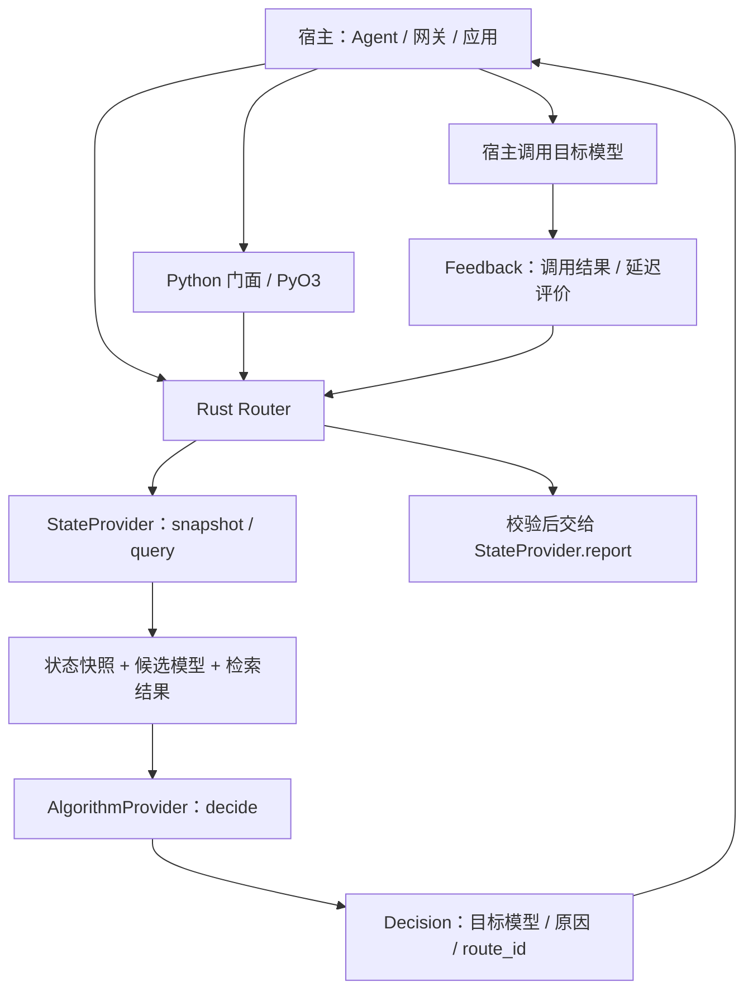

# openjiuwen-router 开源准备度评审

评审日期：2026-09-21。代码基线：`2a05141`，评审开始时工作区干净，Git 跟踪文件 118 个。本文仅新增评审记录，不修改被评审实现。

**判断：项目具备作为早期模型路由 SDK 开源的架构基础，但当前版本不建议直接作为首个可用版本发布。应先完成许可与来源整理、修复测试和入门示例、明确 Python 包身份，并修复或关闭有误导性的能力入口。完成这些收敛后，可以发布范围明确的 Alpha；目前证据不足以支持稳定版或生产成熟度承诺。**

参考项目为本机 `jiuwenswarm`，重点借鉴其文档导航、用户与开发者路径、贡献指南和许可文件组织。该项目自身的功能规模、部署复杂度和所有实现细节不作为本项目的必达标准。本次也没有对参考项目开展完整质量审计。

## 1. 架构特征

### 1.1 可嵌入的决策内核

宿主调用 `route` 获取目标模型，再自行执行模型请求，最后调用 `report` 回传结果。模型凭据、流式传输、模型调用重试属于宿主。这个边界适合 SDK、Agent 或网关嵌入，避免把模型执行协议绑定进路由内核。



这里“不代理模型流量”不意味着路由无成本：x-router 的分类器会在决策路径执行推理，可选 judge 还会执行评分请求。

### 1.2 五层结构清晰，状态层与算法层相互独立

| 层 | 当前职责 | 架构价值与边界 |
|---|---|---|
| `protocol` | 请求、决策、反馈、状态查询与训练载荷；当前零外部依赖 | Rust 与 Python 共用契约；版本化扩展和载荷限制已有实现。零依赖不等于已有网络序列化协议 |
| `state` | `StateProvider`；MemoryState、RemoteState 占位、可选 query | 跨请求记忆外置，算法读取快照；远程服务尚未实现 |
| `algorithms` | `AlgorithmProvider`、`EvolvingProvider`、内置算法与 feature 开关 | 决策与训练计算分开；多个具名算法仍为示意实现 |
| `runtime` | TOML 装配、注册表、候选过滤、决策、反馈校验 | 宿主接口统一；训练触发与发布没有接入主运行路径 |
| `py` + Python 包 | PyO3 类型转换、Python 算法与状态反向适配 | 两种语言可复用运行时，但 Python 重型算法并非都在 Rust 执行 |

证据：[workspace](/Users/ruiwang1/workspace/src/routers/private-model-router/Cargo.toml:1)、[决策循环](/Users/ruiwang1/workspace/src/routers/private-model-router/crates/runtime/src/decide_loop.rs:37)、[Python 装配](/Users/ruiwang1/workspace/src/routers/private-model-router/crates/py/src/lib.rs:95)。

### 1.3 单算法槽、单状态槽，配置期装配

一个 Router 同时持有一个算法与一个状态实现。Rust 可用 `from_parts` 注入，Python 可注册插件并按名称装配；Rust 内置算法由 feature 控制。它适合把不同团队的实现接到同一条决策链。

代价是目前缺少统一的实例级算法参数工厂：x-router 要生成带类属性的子类并写入全局注册表。插件同名覆盖、自动导入和实例共享需要明确治理。它也不是已经支持任意组合的策略执行图。

### 1.4 状态作为可丢失的提示，反馈作为扩展点

请求和状态中的排除项合并后生成候选集；`StateQuery` 可取回相似历史，失败时降级；`Feedback` 采用稳定核心与版本化 `extensions`，Rust 入口统一校验结构和预算。`route_id` 关联查询、决策和延迟反馈，但不提供分布式去重或 exactly-once。

这为算法演进留下了空间，也意味着宿主仍需管理业务持久化、可靠事件投递、重试和租户边界。

### 1.5 已有两类实际路由能力，成熟度需分别描述

- Rust `stage_router`：基于对话与工具信号进行高效模型/高能力模型选择；文件声明改编自 NVIDIA Switchyard。
- Python `x-router`：复杂度分类 → 档位映射 → 可选相似历史效用修正。Bandit 当前按近邻质量和成本估计效用，不等同于完整训练平台。
- `XRouterService` 是进程内便利封装，提供后台 judge 评分、有界任务队列、统计与错误回调；它不是已经部署好的 HTTP 服务。
- 通用 `EvolvingProvider` / Trigger / CAS 发布仍是骨架。不能用 x-router 已有的反馈闭环证明通用自演进链路也已完成。

“所有算法都是相同输入必得相同输出的纯函数”目前过于绝对。x-router 自己的实现说明明确指出模型分类可能不确定，应区分纯规则策略与有推理效果的分类器后端。[x-router 契约说明](/Users/ruiwang1/workspace/src/routers/private-model-router/python/openjiuwen/x_router/algorithm.py:64)

## 2. 文档：对照 jiuwenswarm 的评估

当前优势是已经有中英文架构说明、调用与依赖图、配置表、错误语义、插件示例、实现边界表，以及各 crate 和 x-router 的 README。问题集中在入口、同步和可执行性，不能简单评价为“没有文档”。

| 读者任务 | jiuwenswarm 的组织方式 | 当前项目 | 建议 |
|---|---|---|---|
| 第一次了解项目 | 中英文首页，定位、安装、文档导航、社区入口 | 根 README 只有中文；部分描述停留在早期骨架 | 中英文首页同步，写明 Alpha 范围和可用算法 |
| 安装并完成第一次调用 | 独立安装指南、Quickstart | 分散在根 README、Python 和 x-router README；根 Rust 示例过期 | 提供可从空环境执行的离线最小闭环，另列可选模型依赖 |
| 查配置和排错 | 独立配置、日志、FAQ 页面 | 内容主要埋在 1056 行中文架构文档及各 README 中 | 建文档首页，将现有内容提炼成配置、错误与 FAQ 导航 |
| 开发插件 | developer guide 与开发实践 | 插件契约、反向绑定说明已有较好基础 | 保留深度，拆分算法、状态、反馈扩展的任务指南 |
| 提交修改 | 贡献指南包含环境、PR、审查、版本发布 | 根 README 只有简短贡献段落 | 补可执行的开发、测试、审查与发布约定 |
| 判断可否使用与分发 | LICENSE、第三方软件说明 | 只有许可名称声明，没有根许可证文本 | 先补许可证和来源核对，再完善发布包元数据 |

参考证据：[文档导航](/Users/ruiwang1/workspace/src/jiuwen_workspace/openjiuwen/atom/jiuwenswarm/docs/README.md:13)、[贡献指南](/Users/ruiwang1/workspace/src/jiuwen_workspace/openjiuwen/atom/jiuwenswarm/docs/zh/贡献指南.md:32)、[开发者指南](/Users/ruiwang1/workspace/src/jiuwen_workspace/openjiuwen/atom/jiuwenswarm/docs/zh/developer_guide.md:5)、[测试指南](/Users/ruiwang1/workspace/src/jiuwen_workspace/openjiuwen/atom/jiuwenswarm/tests/README.md:11)。

适合当前规模的目标结构如下；不需要复制参考项目的大量产品功能页面：

```text
README.md / README_CN.md
LICENSE
THIRD_PARTY_NOTICES.md       # 名称可调整，内容来自实际来源核对
CONTRIBUTING.md
SECURITY.md
CHANGELOG.md
docs/README.md
docs/{zh,en}/
  quickstart.md              # 无模型、无外部服务的最小 route/report
  installation.md           # 核心/分类器/Bandit 的环境与构建矩阵
  architecture.md           # 保留现有深度，区分已实现与规划
  configuration.md
  algorithms.md             # 每种算法的状态、输入、代价与限制
  plugins.md                # 算法、状态、反馈扩展接入
  testing.md
  troubleshooting.md
  security-and-data.md
```

## 3. 按严重程度分类的问题

分级用于本次发布决策，不是漏洞评分：**P0 阻断相应首发路径；P1 在开放给外部集成前修复或明确禁用；P2 可随 Alpha 收集反馈，但应在稳定版前解决；P3 为维护与呈现优化。**

### P0：首发阻断

**P0-01：许可证交付与第三方来源记录不完整。**

根 README 和 Cargo 声明 Apache-2.0，但 Git 跟踪文件中没有 LICENSE 或 NOTICE。实际构建的 wheel 也没有许可证文件，METADATA 中没有 `License` / `License-Expression`。`stage_router` 有 NVIDIA 版权头，并写明从 Switchyard 改编，仓库没有对应来源 URL、版本/提交和引入范围清单。

建议补正式许可证文本，建立该改编代码的来源记录、修改说明与上游许可/NOTICE 核对，再覆盖分发产物。Apache-2.0 要求向接收者提供许可证并保留相关声明；NOTICE 的继承要求取决于上游是否包含 NOTICE，**不能把每个 Apache 项目都必须新建 NOTICE 当作通用规则**。这里确认的是交付材料不完整，不是判定存在侵权。[版权与改编声明](/Users/ruiwang1/workspace/src/routers/private-model-router/crates/algorithms/src/stage_router/mod.rs:1)、[Apache-2.0 第 4 节](https://www.apache.org/licenses/LICENSE-2.0)

**P0-02：README 推荐的 Rust 全量测试无法编译。**

实测 `cargo test --offline` 在 `crates/protocol/src/training.rs` 第 191、213、225 行失败：`Message` 新增了 `tool_calls`，三处测试构造没有跟进。`cargo check --offline --workspace` 能通过，因此这是测试目标的协议迁移遗漏，不能描述成整个核心都无法构建。

建议一次性核对公开类型变更影响的所有测试、示例与文档，并让核心测试成为发布门禁。[首个错误位置](/Users/ruiwang1/workspace/src/routers/private-model-router/crates/protocol/src/training.rs:191)、[当前 Message 定义](/Users/ruiwang1/workspace/src/routers/private-model-router/crates/protocol/src/request.rs:14)

**P0-03：独立 Python 发行包与现有 openJiuwen Core 同名。**

本项目 `[project].name = "openjiuwen"`，导入包也是 `openjiuwen`。PyPI 上该名字已经对应 openJiuwen Core；参考项目 jiuwenswarm 也直接依赖现有 `openjiuwen`。二者会被依赖解析视为同一个发行包，不能作为两个独立同名组件正常安装；仅改发行名但仍共同拥有顶层 `__init__.py` 也不足以解决文件冲突。

如果本项目独立发布，应确定独立发行名和不冲突的导入路径，例如候选 `openjiuwen-router` / `openjiuwen_router`，并另行核验名称可用性；如果计划并入 Core，则明确组件归属和统一发布方案。这个问题阻断独立 wheel/PyPI 发行，不阻止私有环境中的源码试验。[本项目元数据](/Users/ruiwang1/workspace/src/routers/private-model-router/pyproject.toml:5)、[jiuwenswarm 的实际依赖](/Users/ruiwang1/workspace/src/jiuwen_workspace/openjiuwen/atom/jiuwenswarm/pyproject.toml:20)、[PyPI openjiuwen](https://pypi.org/project/openjiuwen/)

### P1：外部使用容易失败或产生错误预期

| 编号 | 问题、触发与影响 | 证据 | 建议与验收 |
|---|---|---|---|
| P1-01 | 根 README 的 Rust 示例仍用 `Feedback.outcome/latency_ms/cache_valid` 顶层字段；复制编译失败。首页还称完整 PyO3 绑定为桩，与当前实现不符 | [示例](/Users/ruiwang1/workspace/src/routers/private-model-router/README.md:157)；已提取代码块独立编译，得到 E0560 | 示例复用可编译源码或加入文档示例检查；首页能力表与代码一致 |
| P1-02 | 未实现能力可以正常装配：remote 永远空读、空写，weighted 等退化为首个目标，evolving 只解析，KV 回调只保存。云 profile 被用于入门示例，调用者可能把成功启动误当成功启用 | [remote](/Users/ruiwang1/workspace/src/routers/private-model-router/crates/state/src/test_state/remote.rs:25)、[weighted](/Users/ruiwang1/workspace/src/routers/private-model-router/crates/algorithms/src/test_algo/routing/weighted.rs:13)、[装配](/Users/ruiwang1/workspace/src/routers/private-model-router/crates/runtime/src/router.rs:45) | 首发可缩小范围：默认只暴露可用实现；未支持的配置启动时报明确错误，或以显式 experimental/demo 开关隔离。不要求首发前完成全部规划 |
| P1-03 | Python `async route/report` 直接执行同步方法；分类器或慢 state 会阻塞宿主事件循环。PyO3 route 也没有显式释放 GIL 执行核心 | [async 包装](/Users/ruiwang1/workspace/src/routers/private-model-router/python/openjiuwen/__init__.py:143)、[PyO3 调用](/Users/ruiwang1/workspace/src/routers/private-model-router/crates/py/src/lib.rs:66) | 明确同步接口，或实现受控异步桥接；用慢后端和并发请求证明事件循环响应、超时及取消语义。架构文档已有说明，但首页调用方式仍容易误导 |
| P1-04 | Runtime 过滤了候选，却直接接受插件返回值；自定义算法能返回已排除或目录外模型。实测请求排除 `excluded` 后，Router 仍成功返回它 | [直接返回算法结果](/Users/ruiwang1/workspace/src/routers/private-model-router/crates/runtime/src/decide_loop.rs:46) | 在 runtime 验证候选非空、输出目标属于过滤后的候选集；错误统一映射。它是正确性保障，不应把插件描述成不可信代码沙箱 |
| P1-05 | BanditStore 的 `max_entries` 只限制已评分 records；pending 没有数量硬上限，会话 `_keys` 没有全局清理。评分缺失或会话不断新增时内存持续增长 | [pending 写入](/Users/ruiwang1/workspace/src/routers/private-model-router/python/openjiuwen/x_router/bandit_store.py:219)、[仅过期清扫](/Users/ruiwang1/workspace/src/routers/private-model-router/python/openjiuwen/x_router/bandit_store.py:353)、[会话写入](/Users/ruiwang1/workspace/src/routers/private-model-router/python/openjiuwen/x_router/bandit_store.py:304) | 分别限定 records、pending、会话表容量与字节预算；提供过期清理和淘汰指标。实测 `max_entries=2` 可积累 pending=100、keys=100；过期清扫后 keys 仍为 100 |
| P1-06 | Python 支持范围与依赖不一致：声明 ≥3.8，x-router 要求 transformers≥5.0；5.0.0 的发布元数据要求 Python≥3.10。Python<3.11 的 TOML 读取依赖 tomli，但未声明 | [依赖声明](/Users/ruiwang1/workspace/src/routers/private-model-router/pyproject.toml:9)、[TOML 读取](/Users/ruiwang1/workspace/src/routers/private-model-router/python/openjiuwen/x_router/facade.py:55)、[Transformers 5.0.0 元数据](https://pypi.org/project/transformers/5.0.0/) | 明确核心与各 extra 的版本矩阵，补条件依赖或调整最低版本。已在本机 Python 3.9 复现缺 tomli 的配置读取错误；不能把该结论扩大为基础 Rust/Python 核心不支持 3.8 |
| P1-07 | 当前跟踪文件未包含 CI 工作流；Rust 格式检查失败；大量 Python 集成测试在扩展缺失时会跳过。仅执行 pytest 或 cargo check 不能证明发布可用 | [跳过机制](/Users/ruiwang1/workspace/src/routers/private-model-router/tests/test_react_agent.py:5)、[测试说明](/Users/ruiwang1/workspace/src/routers/private-model-router/python/openjiuwen/x_router/README.md:431) | CI 先构建扩展，再跑核心集成；将纯 Python、原生桥接、真实模型测试分开；固定预期跳过项。未检查远程托管平台，外部 CI 和分支保护配置状态未知 |

### P2：稳定维护、生产接入和社区协作的缺口

| 编号 | 问题与影响 | 建议 |
|---|---|---|
| P2-01 | 文档信息分散；没有统一首页、独立开发/测试/排错路径；多处引用缺失的 `DESIGN.md` 和未随仓库提供的蓝图 HTML。当前 Markdown 相对链接扫描未发现断链，这些属于文本引用缺失 | 按读者任务重组已有内容；补齐或替换设计基线引用；为中英文文档明确同步责任 |
| P2-02 | MemoryState 在 report 时不先清除过期条目，会把旧排除项续期；持续反馈还会延长整个 key 的排除时间。满容量时删除 HashMap 的任意首项，文档却写“最旧条目” | 明确 key TTL 与模型故障冷却 TTL；过期后写入应重建条目；实现真实淘汰顺序或如实描述。已复现过期失败项被后续成功反馈重新带回，[位置](/Users/ruiwang1/workspace/src/routers/private-model-router/crates/state/src/test_state/memory.rs:107) |
| P2-03 | Python 插件依赖进程全局注册与 import 副作用；同名注册覆盖，算法参数靠动态子类传入；异常靠字符串识别部分错误类型 | 引入显式实例/工厂装配、稳定错误类型、名称冲突策略与插件契约测试；已有文档提示同名覆盖，但还缺更易维护的 API，[注册表](/Users/ruiwang1/workspace/src/routers/private-model-router/crates/py/src/adapter.rs:68) |
| P2-04 | Python state 的 snapshot/report 异常被吞掉；Router 的 report 有静默丢弃路径。x-router service 已有 stats/logging，内核链路还没有一致诊断接口 | 区分正常冷启动、后端故障、反馈丢弃、队列拥塞；提供可选事件/指标 hook，避免路由可用但长期失去反馈无人知晓，[state adapter](/Users/ruiwang1/workspace/src/routers/private-model-router/crates/py/src/state_adapter.rs:32) |
| P2-05 | 缺完整贡献指南、安全报告入口、维护责任、变更日志与兼容承诺；协议类型公开字段易发生破坏性变更 | 定义贡献流程、支持范围、版本策略和弃用规则；给公开结构体提供便捷构造；不必为了 Alpha 建立复杂委员会或强制 CLA |
| P2-06 | 未看到随仓库交付的可复现路由效果评测：成本、质量、端到端延迟、分类器自身开销、不同模型配置与冷/热状态的对照 | 提供小型有来源的样本集和基线（固定模型、passthrough、规则、x-router、加 Bandit）；记录模型/提示/参数版本。测试正确性不等于证明节省成本或提高质量 |
| P2-07 | 用户文档未集中说明数据边界：API judge 会发送对话和响应；Bandit 近邻记录在实例内共享，RoutingKey 不含独立 tenant 字段；缺省 session/agent 会落入同一空 key | 提供数据流、保留与删除、日志脱敏、插件信任及租户隔离说明；多租户按实例/命名空间隔离。API judge 外发是配置启用的功能，不是已确认的未授权泄露，[显式外发说明](/Users/ruiwang1/workspace/src/routers/private-model-router/python/openjiuwen/x_router/service.py:32) |
| P2-08 | 分发与复现策略未完成：workspace 禁止发布，内部依赖只有 path，Rust 无 MSRV 声明；Python 没有完整首页/仓库/维护者元数据和开发依赖组，未提供受支持平台产物矩阵 | 明确源码、wheel、crates 各自发布范围。源码 Alpha 可保留 `publish=false`；若发 crates 再补版本化依赖。为 CI/发布固定可复现依赖方案，不把“库必须提交 Cargo.lock”当作硬要求 |
| P2-09 | `XRouterService.close(timeout=正数)` 只是转换为 `shutdown(wait=True)`，没有实际按秒超时，慢或挂起的 judge 可能拖住关闭 | 实现真实等待预算/未完成任务处置，或删除误导性参数并写清关闭语义，[实现](/Users/ruiwang1/workspace/src/routers/private-model-router/python/openjiuwen/x_router/service.py:417) |

### P3：维护与呈现优化

- 清理个人环境说明，例如根 README 中的 `rust_demo_mod_04` 和未跟踪的 `.vscode/settings.json` 引用；仓库名、展示名、发行名保持一致。
- 将示意算法与正式算法入口清楚区分，避免公开 API 长期暴露 `test_algo`、`test_state` 等内部历史命名；保留必要兼容导出并说明弃用计划。
- 有了真实 CI 与可复现数据后再补徽章、性能图表和更丰富的示例。无需把品牌素材、文档站或社区规模当作首发门槛。

## 4. 实际核验与范围限制

本机环境为 macOS；Rust 1.94.1；Python 配置兼容问题用系统 Python 3.9.6 复现，Python 测试环境使用独立临时 Python 3.12.14。没有调用真实目标模型或外部 judge，没有改动已有源码。

| 检查 | 结果 |
|---|---|
| `cargo check --offline --workspace` | 通过，包含 PyO3 crate |
| `cargo test --offline` | 失败：三处 `Message` 构造遗漏 `tool_calls`，测试未完整执行 |
| `cargo test --offline -p openjiuwen-runtime --test react_agent` | 通过，1 个集成测试 |
| `cargo fmt --all -- --check` | 未通过，多处格式差异；没有自动格式化 |
| 根 README Rust 代码块独立编译 | 失败，三个过期的 Feedback 字段 |
| 排除目标越界返回 | 复现：自定义算法返回已排除目标，Router 仍成功 |
| MemoryState 过期后先 report | 复现：旧排除项被重新续期 |
| BanditStore 容量与清理 | 复现：上限 2，pending 和会话表各累积到 100；pending 过期清理不清会话表 |
| Python 3.9 读取 x-router TOML | 复现：缺少未声明的 tomli 依赖 |
| `maturin develop --offline --uv` | 在临时 Python 3.12 环境构建、安装原生扩展成功 |
| `python -m pytest -q -ra` | **136 passed，5 skipped**；跳过项全部是真实分类模型测试，原因为没有配置 `X_ROUTER_CLASSIFIER_MODEL` |
| `maturin build --offline` | 成功生成 macOS arm64 的 `cp38-abi3` wheel；这不是对所有 Python 版本和操作系统的兼容性证明 |
| 独立环境 wheel 安装与运行 | 成功；从 checkout 之外导入 site-packages，完成 `a → report(Unavailable) → b` 换模闭环 |
| wheel 内容检查 | 没有 license/notice 文件、许可元数据、项目 URL 或长描述；需完善发行材料 |
| 跟踪 Markdown 的相对文件链接 | 本次扫描未发现不存在的目标；不覆盖所有锚点或裸文本引用 |
| 当前跟踪文件的有限敏感模式扫描 | 未命中所检查的私钥、GitHub token、AWS access key 等模式；不等同于完整 secret audit |

未覆盖：全 Git 历史的凭据审计、依赖漏洞数据库扫描、所有依赖的许可兼容性审计、远端 CI/权限配置、Linux/Windows 真机验证、真实模型质量/性能评测和生产负载测试。这些未知项没有被写成已通过，也没有被当成已经发生的漏洞。

## 5. 建议的首发范围和推进顺序

1. **先闭合发布身份与许可**：确定与 openJiuwen Core 的关系及发行/导入名称；补 LICENSE 和实际第三方来源记录。
2. **恢复可重复的主路径**：修复 Rust 全量测试、首页示例、Python 依赖声明和格式检查；建立先构建扩展再测集成的 CI。
3. **收紧公开能力**：默认采用 memory 和已实现算法；对 remote、占位算法、未接线训练、KV 回调等能力显式禁用或标为实验；修复目标校验和 Bandit 容量；明确同步/异步边界。
4. **整理用户与贡献者入口**：复用现有架构内容，补导航、可执行 Quickstart、开发测试、FAQ、安全数据说明和贡献入口。
5. **发布范围明确的 Alpha**：写清支持平台、功能与不兼容变更政策；用真实反馈决定是否推进远程状态、训练调度和性能优化，再评估 Beta/稳定版。

首发验收应以“陌生开发者能安装、完成一次失败换模闭环、看懂能力边界并提交可验证修改”为准。开源不要求实现所有规划能力，但已公开且标为可用的能力必须与代码和测试一致。
